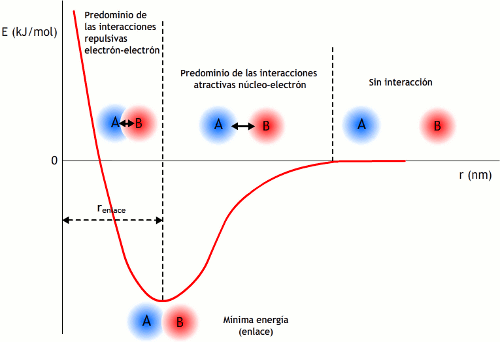
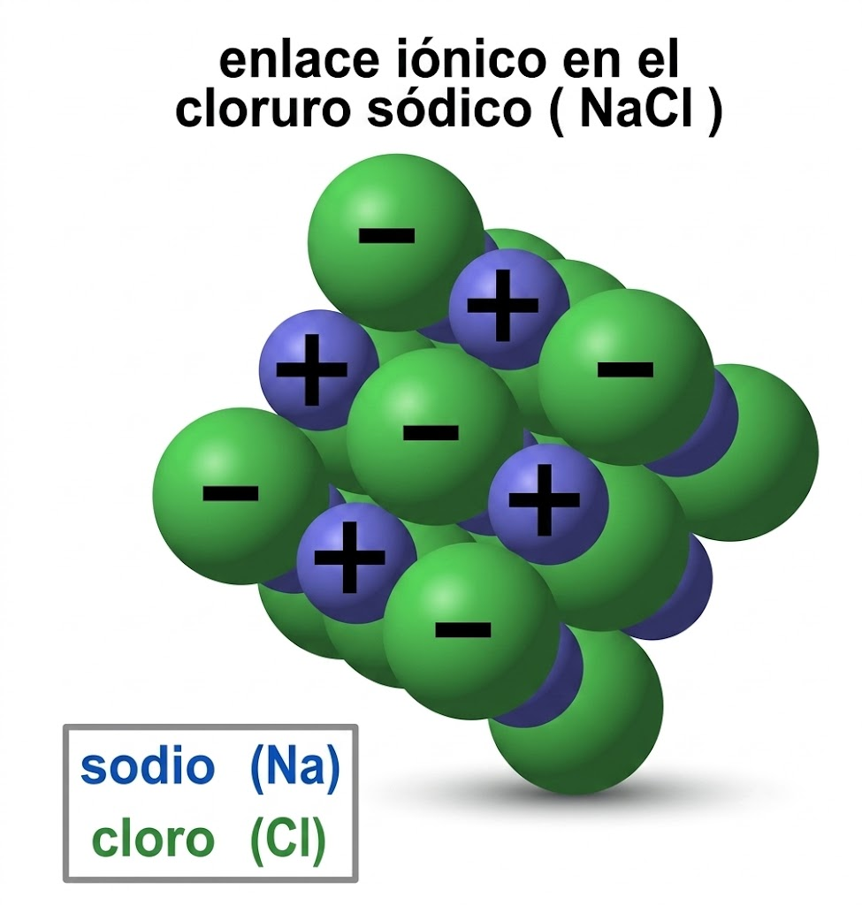
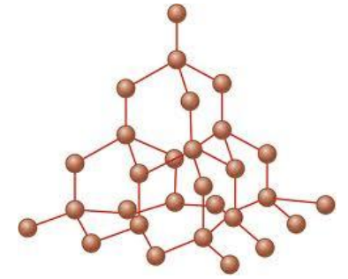
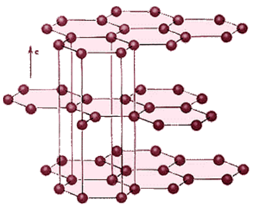
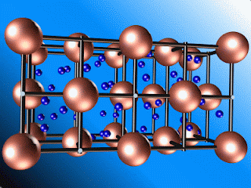

# Tema 2: Enlace químico

## 1. **Introducción**

La causa determinante de que los átomos traten de combinarse unos con otros es la tendencia de todos ellos a adquirir la configuración de gas noble ($\ce{ns np^6}$) en su capa más externa o “capa de valencia”.

Ésta es una configuración especialmente estable a la que tienden todos los elementos. En consecuencia, y en función de la configuración de su capa de valencia, tendrán lugar distintos tipos de procesos (transferencia de electrones, compartición...) que darán lugar a los distintos tipos de enlace químico.

El estudio de las variaciones de energía que tienen lugar cuando dos especies químicas (átomos neutros, iones...) se aproximan desde una distancia grande, donde suponemos que no existe ningún tipo de interacción electrostática (atracciones o repulsiones) entre sus núcleos y electrones, nos aporta una valiosa información sobre el enlace.

En la gráfica se observa como a medida que se acercan A y B las interacciones atractivas entre los núcleos y electrones son predominantes. **La energía del sistema disminuye, ganando en estabilidad**, y tienden a acercarse uno a otro, pero a partir de determinada distancia las interacciones repulsivas entre los electrones (también entre los núcleos) se vuelven más importantes, con lo cual se produce una aumento de la energía del sistema, lo que le hace perder estabilidad y tienden a separarse.

El mínimo de energía se corresponderá, por tanto, con la agrupación más estable entre A y B. Se dice entonces que existe enlace entre A y B. La distancia correspondiente se denomina **distancia de enlace**.

{ style="display: block; margin: 0 auto; height: 450px; width: 100%;" }

**TIPOS DE ENLACE QUÍMICO**

**Enlace iónico**: Las **unidades estructurales básicas** enlazadas son iones de signo contrario (**aniones** y **cationes**). Los iones se mantienen unidos mediante fuerzas de naturaleza electrostática, debidas a la presencia de cargas de distinto signo.

**Enlace covalente**: Las **unidades estructurales básicas** enlazadas son **átomos**. Los átomos se mantienen unidos para poder compartir electrones de su capa de valencia.

**Enlace metálico**: Las **unidades estructurales básicas** enlazadas son **átomos con carga positiva** (modelo de "nube electrónica"). Los átomos se mantienen unidos mediante electrones deslocalizados que se sitúan entre los cationes.

**TIPOS DE SÓLIDOS**.

Básicamente podemos encontrar varios tipos de sólidos, según sea el enlace: sólidos **iónicos**, sólidos de red **covalente**, sólidos **metálicos** y sólidos **moleculares**.

**SÓLIDOS IÓNICOS**. Las **unidades estructurales básicas** de estos compuestos son **iones** (aniones y cationes) unidos mediante enlaces iónicos.

El **enlace iónico es muy fuerte**, razón por la que poseen **elevados puntos de fusión **y **ebullición**.

Ejemplos de sólidos iónicos son el cloruro de sodio (NaCl), la fluorita ($\ce{CaF2}$) o el óxido de titanio o rutilo ($\ce{TiO2}$)

{ style="display: block; margin: 0 auto; height: 250px; width: 45%;" }

**SÓLIDOS DE RED COVALENTE**

Las **unidades estructurales** son **átomos neutros que se unen entre si mediante enlaces covalentes** formando una estructura tridimensional o red. Los enlaces covalentes son muy fuertes (incluso más que los iónicos), razón por la que los compuestos de red covalente presentan una elevada dureza. Ejemplos de sólidos covalentes: diamante, silicatos, grafito...

**Diamante**

Red de átomos de carbono unidos mediante enlaces covalentes formando tetraedros que se repiten en el espacio formando una red covalente.

{ style="display: block; margin: 0 auto; height: 250px; width: 45%;" }

**Grafito**

Los carbonos se unen entre sí mediante tres enlaces covalentes formando hexágonos, que a su vez se distribuyen en capas que se mantienen débilmente unidas gracias a electrones que se sitúan entre ellas. Estos electrones se pueden mover con cierta facilidad lo que confiere al grafito propiedades conductoras.

La unión entre las láminas es muy débil, siendo por tanto muy fáciles de separar.

{ style="display: block; margin: 0 auto; height: 250px; width: 45%;" }

**SÓLIDOS METÁLICOS**

Las **unidades estructurales** son **iones positivos de metales** entre los que se sitúan electrones prácticamente libres formando una especie de "gas o nube electrónica".

Los **electrones libres** son los **responsables de las propiedades conductoras de los metales** y la fortaleza del enlace justifica asimismo los **puntos de fusión elevados**.

Los **metales** son **ejemplos típicos** de este tipo.

{ style="display: block; margin: 0 auto; height: 250px; width: 45%;" }

**SÓLIDOS MOLECULARES**

Las **unidades básicas** son **moléculas**, pero existen fuerzas entre ellas (intermoleculares) suficientes para unir (aunque débilmente) a las moléculas formando una estructura típica de sólidos.

La debilidad de las fuerzas entre moléculas condicionan que estas sustancias fundan (o sublimen) a temperaturas bajas.

Ejemplos de sólidos moleculares son el yodo o las parafinas.

El agua es sólida por debajo de 0 ◦C a presión de 1 atm. Las uniones que se representan en la figura por líneas negras son puentes de hidrógeno entre las moléculas.