# Tema 3: Termoquímica

## **1. Introducción a la Termoquímica**

**Termoquímica**. Parte de la termodinámica que estudia el intercambio de energía en las reacciones químicas.

Las reacciones químicas obedecen a dos leyes fundamentales:

- La ley de la **conservación de la masa** y

- La ley de la **conservación de la energía**.

La energía no se crea ni se destruye, solo se convierte de una forma en otra.

La energía total del universo permanece constante.

Todas las reacciones químicas absorben o liberan energía, por lo general en forma de calor.

{style="display: block; margin: 0 auto; width: 20%; border: 1px solid #333;"}

**La energía**

Es una propiedad de los cuerpos o sistemas que se relaciona con su capacidad para producir cambios en otros cuerpos o sistemas o en ellos mismos.

Para entender el significado de esta magnitud debemos conocer sus propiedades:

- transformación, cambiando la forma en la que se presenta: $\ce{E_C, E_P, E_{química}}$,...

- conservación de la cantidad total de energía

- degradación o pérdida de utilidad de la energía

- transferencia de energía de un sistema a otro

La unidad de energía en el S.I. es el **julio** (**J**)

Otra unidad: la caloría (cal) $\hspace{1cm}$ 1 cal = 4,18 J

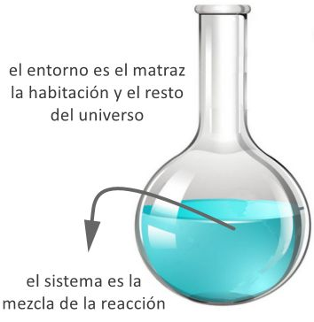{style="display: block; margin: 0 auto; width: 20%; border: 1px solid #333;"}

**Sistemas termodinámicos**

Parte del mundo físico que aislamos para su estudio mediante paredes reales o imaginarias. El resto del universo, que no forma parte del sistema, se llama entorno.

**Tipos de sistemas**:

  

    

      ABIERTOS
    

    

      Pueden intercambiar materia y energía con su entorno
    

    

      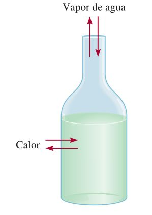
    

  

  

    

      CERRADOS
    

    

      Intercambian energía con su entorno pero no materia
    

    

      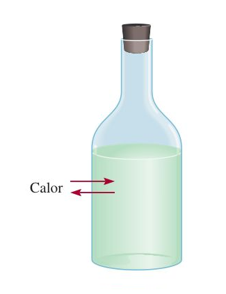
    

  

  

    

      AISLADOS
    

    

      No intercambian ni materia ni energía con su entorno
    

    

      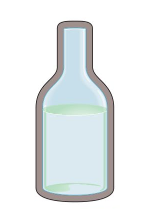
    

  

**Ejemplos de tipos de sistemas**

  

    

      ABIERTOS
    

    

      La hoguera necesita combustible para arder y cede CO2, vapor de agua y energía en forma de calor
    

    

      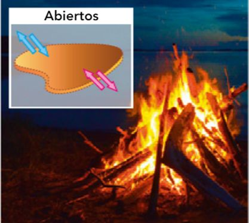
    

  

  

    

      CERRADOS
    

    

      La bombilla necesita energía eléctrica para emitir luz. Si se corta la corriente no se encenderá
    

    

      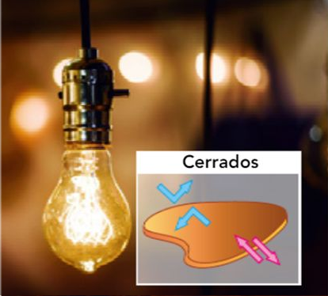
    

  

  

    

      AISLADOS
    

    

      Un termo mantiene constante la temperatura del café que hayamos introducido en él
    

    

      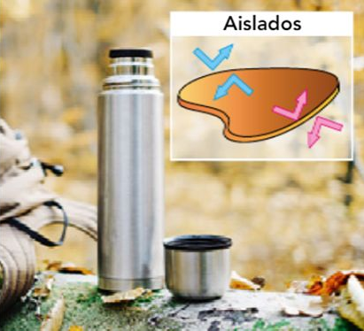
    

  

**Variables termodinámicas**

Son las magnitudes físicas y químicas que caracterizan a un sistema termodinámico. Un estado del sistema viene determinado por los valores que toman dichas variables.

**Tipos**:

- **Extensivas**: su valor depende de la cantidad de materia del sistema. La
masa, el volumen, la cantidad de sustancia, la energía interna, la entropía,
etc.

- **Intensivas**: su valor no depende de la cantidad de materia del sistema.
Por ejemplo, la concentración, la densidad, la temperatura, etc.

**Funciones de estado**: variables termodinámicas cuyo valor depende solo de los estados inicial y final de un sistema, y no del proceso seguido.

<table style="border: none; border-collapse: collapse;">
  <tr>
    <td style="border: none;"></td>
    <td style="border: none;">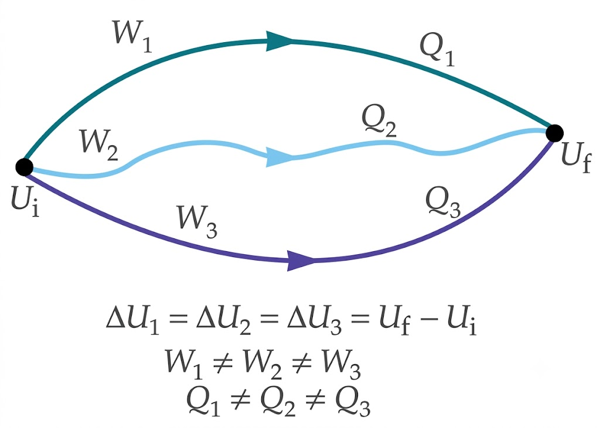</td>
  </tr>
</table>

Son funciones de estado el volumen, la presión, la energía interna, la entalpía, la entropía, etc

**Transferencia de energía: calor y trabajo**

Cuando aumenta o disminuye la energía de un sistema, se dice que ha habido una transferencia de energía entre el sistema y el entorno, que puede hacerse en forma de:

- **Calor** ($\ce{Q}$): debida a una diferencia de temperatura.
  
- **Trabajo** ($\ce{W}$): debida a una fuerza que provoca un desplazamiento.

**Calor y trabajo NO son formas de energía**, sino mecanismos de transferencia de energía.

**Calor**:

- $\ce{Q > 0}$ si el sistema absorbe energía del entorno.

- $\ce{Q < 0}$ si el sistema cede energía al entorno.

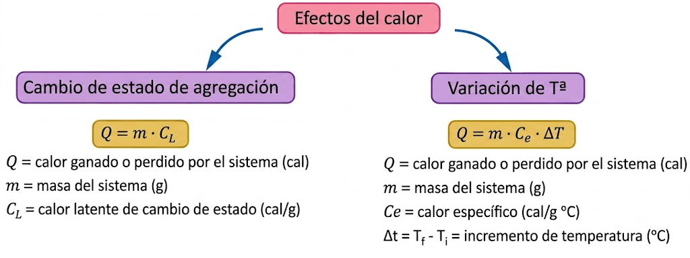{style="display: block; margin: left; width: 90%; height: 300px;"}

**Trabajo**

Trabajo realizado por una fuerza: fuerza por el desplazamiento de su punto de aplicación y por el coseno del ángulo que forman las direcciones de la fuerza y el desplazamiento.

$\ce{W = F \cdot \Delta x \cdot cos \alpha}$
{ style="border: 2px solid #34077d; border-radius: 12px; padding: 15px; text-align: center; max-width: 200px; margin: 20px auto; display: block; background: #fcede6" }

Unidad de trabajo en S.I: **julio** (**J**)

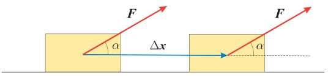{style="display: block; margin: left; width: 70%; height: 150px; "}

**Trabajo de expansión-compresión** asociado a los cambios de volumen, $\ce{\Delta V}$, que sufre un sistema sometido a una presión, p.

$\ce{\hspace{5cm} W = F \cdot \Delta x \cdot cos \alpha \hspace{1cm} \longrightarrow \hspace{1cm} W = F \cdot \Delta x }$

$$
\left\{
\begin{array}{c}
\ce{\alpha \; = 0} \\
\ce{cos \alpha \; = 1}
\end{array}
\right\} \quad \ce{F = p \cdot S} \quad 
\left\{
\begin{array}{l}
\ce{p, presión a la que esta sometido el gas} \\
\ce{S, la sección del cilindro}
\end{array}
\right.
$$

$\ce{W = - p \cdot \Delta V}$
{ style="border: 2px solid #34077d; border-radius: 12px; padding: 15px; text-align: center; max-width: 200px; margin: 20px auto; display: block; background: #fcede6" }

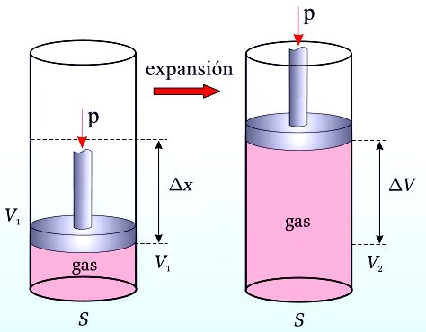{style="display: block; margin: left; width: 50%; height: 275px; border: 1px solid #333;"}

- En un proceso de expansión: $\ce{\Delta V > 0 \; \rightarrow \; W < 0}$ trabajo hecho por el sistema sobre el entorno.

- En un proceso de compresión: $\ce{\Delta V < 0 \; \rightarrow \; W > 0}$ trabajo hecho sobre el sistema.

## **02. Principios de la Termodinámica**

**Primer principio de la termodinámica**

Es en esencia el principio de conservación de la energía aplicado a cualquier proceso termodinámico, controlando los intercambios de energía.

**Energía interna** (**$\ce{U}$**): suma de las energías de todas las partículas que forman el sistema (Energía cinética de las partículas, energía potencial, energía vibracional...)

No puede conocerse $\ce{U}$ en valor absoluto, pero si sus variaciones, $\ce{\Delta U}$, en función del calor, $\ce{Q}$, y del trabajo $\ce{W}$, intercambiados con el entorno durante un proceso.

La variación de la energía interna de un sistema es igual a la suma del calor y del trabajo, intercambiado con el entorno.

$\ce{\Delta U = W + Q}$
{ style="border: 2px solid #34077d; border-radius: 12px; padding: 15px; text-align: center; max-width: 200px; margin: 20px auto; display: block; background: #fcede6" }

- $\ce{\Delta U > 0}$, si absorbe calor, $\ce{+Q}$, o si se hace un trabajo sobre él, $\ce{+W}$ (compresión).

- $\ce{\Delta U < 0}$, si pierde calor, $\ce{-Q}$, o si efectúa un trabajo sobre el entorno, $\ce{-W}$ (expansión).

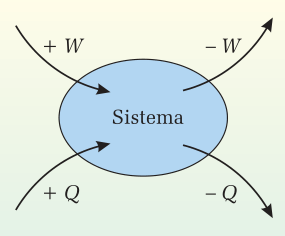{style="display: block; margin: left; width: 30%; height: 225px; border: 1px solid #333;"}

La **energía interna** es una **función de estado**.

**Aplicaciones del primer principio**

Las reacciones químicas, suelen realizarse o bien a $\ce{p = cte}$ o bien a $\ce{V = cte}$. El primer principio sirve para estudiar los intercambios de energía en los procesos químicos.

**Procesos isocóricos** (a **volumen constante**): Reacciones que se llevan a cabo en un recipiente cerrado.

Como $\ce{V = cte \; \Longrightarrow \; W = 0}$.

El calor que se absorbe o se desprende en la reacción, $\ce{Q_\text{v}}$ (calor a volumen cte), coincide con la variación de la energía interna que se produce en dicha reacción.

$$
\begin{array}{l}
\ce{\Delta U = Q + W} \\
\ce{\Delta U = Q - p \cdot \Delta V}
\end{array} \hspace{1.5cm} \ce{V = cte \rightarrow \Delta V = 0}
$$

$\ce{\Delta U = Q_\text{v}}$
{ style="border: 2px solid #34077d; border-radius: 12px; padding: 15px; text-align: center; max-width: 110px; margin: 20px auto; display: block; background: #fcede6" }

Si $\ce{Qv > 0}$, reacción endotérmica, recibe calor del entorno y $\ce{\Delta U > 0}$

Si $\ce{Qv < 0}$, reacción exotérmica, cede calor al entorno y $\ce{\Delta U < 0}$

**Procesos isobáricos** (a **presión constante**): Reacciones que se llevan a cabo en un recipiente abierto y a presión atmosférica.

Calor que se absorbe o se desprende en la reacción, $\ce{Q_\text{p}}$ (calor a p = cte)

$$\ce{\Delta U = Q + W = Q - p \cdot \Delta V}$$

$\ce{Q_\text{p} = \Delta U + p \cdot \Delta V}$
{ style="border: 2px solid #34077d; border-radius: 12px; padding: 15px; text-align: center; max-width: 210px; margin: 20px auto; display: block; background: #fcede6" }

Para expresar la transferencia de calor entre el sistema y el entorno en procesos a p = cte se suele utilizar una nueva magnitud, la **entalpía**, **H**: $\ce{\quad H = U + p \cdot V}$

$\ce{Q_\text{p} = \Delta U + p \cdot \Delta V = (U_2 - U_1) + p \cdot (V_2 - V_1) = U_2 - U_1 + p \cdot V_2 - p \cdot V_1}$

$\ce{Q_\text{p} = (U_2 + p \cdot V_2) - (U_1 + p \cdot V_1) = H_2 - H_1}$

$\ce{p = cte \; \rightarrow \; p_1 = p_2 \hspace{2cm} Q_\text{p} = H_2 - H_1 = \Delta H}$

$\ce{Q_\text{p} = \Delta H}$
{ style="border: 2px solid #34077d; border-radius: 12px; padding: 15px; text-align: center; max-width: 110px; margin: 20px auto; display: block; background: #fcede6" }

Reacción **endotérmica**: $\ce{\quad Q_\text{p} > 0 \; \rightarrow \; H_{productos} > H_{reactivos} \; \rightarrow \; \Delta H > 0}$

Reacción **exotérmica**: $\ce{\quad Q_\text{p} < 0 \; \rightarrow \; H_{productos} < H_{reactivos} \; \rightarrow \; \Delta H < 0 }$

**Relación entre Qp y Qv**

La expresión que relaciona los calores a volumen y a presión constante es:

$\ce{\hspace{5cm} \Delta H = \Delta U + p \cdot \Delta V \quad \rightarrow \quad}$ $\ce{Q_\text{p} = Q_\text{v} + p \cdot \Delta V}$

- Si la **reacción química** se produce entre **sólidos**, **líquidos** o en **disolución**, no se producirán variaciones apreciables de volumen

$\hspace{4cm}$$\ce{Q_\text{p} \approx Q_\text{v}}$$\ce{ \quad \rightarrow \quad \Delta H = \Delta U}$ 

- Si la **reacción química** se produce entre **gases** a una presión y temperaturas determinadas: el valor de $\ce{\Delta n}$ = **variación** de mol de gases al pasar de reactivos a productos = número de **mol de productos gaseosos** $-$ número de **mol de reactivos gaseosos** ($\ce{\Delta n = n_\text{productos} - n_\text{reactivos}}$)

$$\ce{p \cdot \Delta V = \Delta n \cdot R \cdot T}$$

$\ce{\hspace{5cm} Q_\text{p} = Q_\text{V} + \Delta n \cdot R \cdot T \; \rightarrow \; }$ $\ce{\Delta H = \Delta U + \Delta n \cdot R \cdot T}$

En reacciones con $\ce{\Delta n = 0}$ como, $\ce{H2 (g) + F2 (g) \rightarrow 2 HF (g) \; \rightarrow \; \Delta U = \Delta H}$

## **03. Procesos físicos y entalpía**

**Entalpía de reacción \Delta H**

**Energía intercambiada** en forma de calor a **presión constante** cuando los reactivos se han transformado en los productos.

**Ecuación termoquímica**: ecuación ajustada de la reacción en la que se **indica** el **estado físico** de cada sustancia y el **calor intercambiado con el entorno**, normalmente como $\ce{\Delta H}$.

$$\begin{array}{ll}
\ce{HgO (s) \rightarrow Hg (l) + 1/2 O2 (g)} & \ce{\Delta H = + 90,8 kJ/mol} \\
\ce{2 HgO (s) \rightarrow 2 Hg (l) + O2 (g)} & \ce{\Delta H = + 181,6 kJ/mol} \\
\ce{Hg (l) + 1/2 O2 (g) \rightarrow HgO (s)} & \ce{\Delta H = - 90,8 kJ/mol} \\
\end{array}$$

Si **invertimos el orden de la reacción**, se **cambia el signo** de $\ce{\Delta H_r}$.

Si **multiplicamos la ecuación por un número**, **también se multiplica** la $\ce{\Delta H_r}$ ya que la entalpía es una variable extensiva, depende de la cantidad de materia.

**Diagramas entálpicos**

**Diagrama entálpico**: **representación gráfica** de la variación de entalpía entre los reactivos y los productos en una **reacción química**.

  

    

      Reacción endotérmica
    

    

      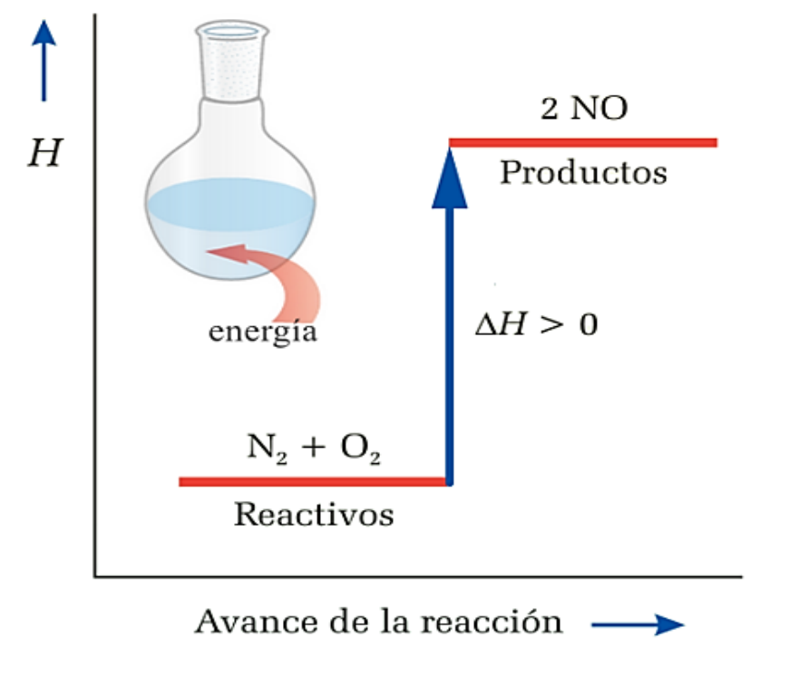
    

    

        Hproductos &nbsp; > &nbsp; Hreactivos &nbsp; &nbsp; &rarr; &nbsp; &nbsp; &Delta; Hr &nbsp; > 0
    

  

  

    

      Reacción exotérmica
    

    

      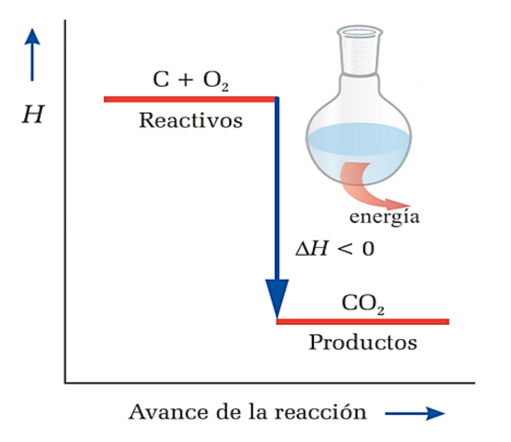
    

    

        Hproductos &nbsp; < &nbsp; Hreactivos &nbsp; &nbsp; &rarr; &nbsp; &nbsp; &Delta; Hr &nbsp; < 0
    

  

## **04. Cálculo de entalpías**

Para averiguar la entalpía de reacción, $\ce{\Delta H_r}$ de un proceso hay varios métodos:

1. A partir de la **determinacion experimental**
2. A partir de las **entalpías de formación**
3. A partir de la **ley de Hess**
4. A partir de las **entalpías de enlace** 

**1. Cálculo a partir de la determinación experimental**:

El calorímetro contiene una masa de agua a cierta T, en la cual, o se produce la reacción, o está en contacto con el recipiente donde ésta ocurre.

La $\ce{\Delta H_r}$ será absorbida o liberada por el agua del calorímetro, lo que hace variar su T.

Como el sistema es adiabático:

$\ce{Q_{reacción} + Q_{agua} = 0 \; \rightarrow \; Q_{reacción} = - Q_{agua}}$

$\ce{Q_{agua} = m \cdot c_{agua} \cdot \Delta T}$
{ style="border: 2px solid #34077d; border-radius: 12px; padding: 15px; text-align: center; max-width: 250px; margin: 20px auto; display: block; background: #f9f7fb" }

La reacción calienta el agua, y también los componentes del calorímetro. El calor invertido en esto es específico de cada calorímetro y debe tenerse en cuenta, o se cometerá un error de medición.

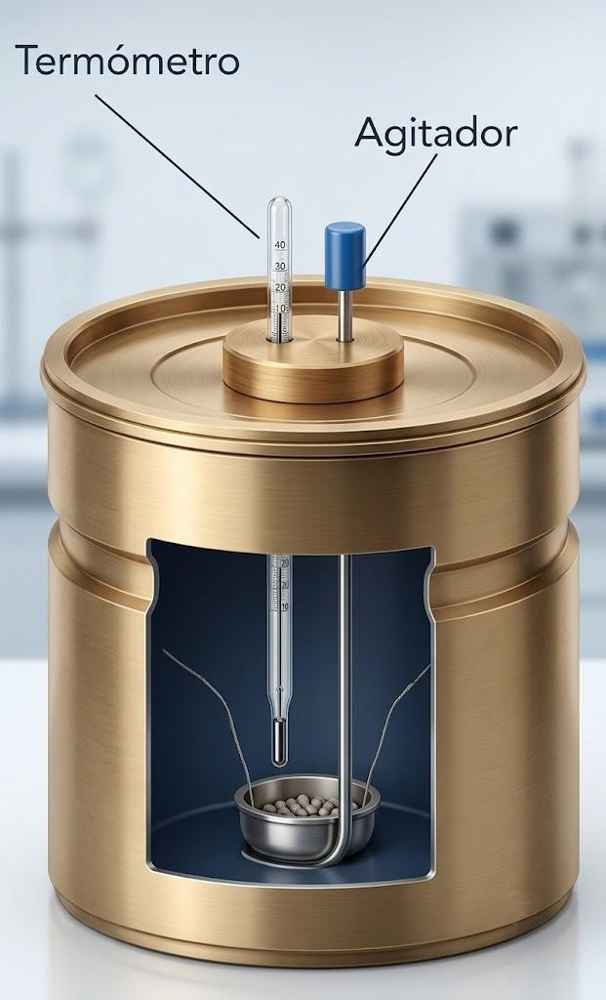{style="display: block; margin: left; width: 25%; height: 300px; border: 1px solid #333;"}

**2. Cálculo de la $\ce{\Delta H_R}$ a partir de entalpías estándar de formación ($\ce{\Delta H^{\circ}_f}$)**

La entalpía de reacción, $\ce{\Delta H_r}$ podría calcularse: $\ce{H_{productos} - H_{reactivos}}$, pero no es posible medir el valor absoluto de H de una sustancia, solo valores relativos con respecto a una referencia arbitraria:

El **punto de referencia** para la H, **es la entalpía estándar de formación** ($\ce{\Delta H^{\circ}_f}$) de **cualquier elemento**, en su forma más estable (a 1 atm y 25 $^{\circ}$C), que es **cero**. 

$\ce{\Delta H^{\circ}_f}$ (C, grafito) = 0 y $\ce{\Delta H^{\circ}_f}$ (C, diamante) = 1,90 kJ/mol

La definición de la **entalpía estándar de formación** $\ce{\Delta H^{\circ}_f}$ de un compuesto sería el calor asociado a la formación de 1 mol de compuesto a partir de sus elementos a una presión de 1 atm.

A partir de las entalpías de formación estándar es posible obtener entalpías de reacción:

$\ce{\Delta H^{\circ}_{reacción} = \sum n \cdot \Delta H^{\circ}_f (productos) - \sum m \cdot \Delta H^{\circ}_f (reactivos)}$
{ style="border: 2px solid #34077d; border-radius: 12px; padding: 15px; text-align: center; max-width: 600px; margin: 20px auto; display: block; background: #f9f7fb" }

$\ce{n, m =}$ coeficientes estequiométricos de productos y reactivos; el estado estándar se designa con el símbolo «$^{\circ}$», y especifica una T, que utiliza valores de $\ce{\Delta H^{\circ}_f}$ a 25 $^{\circ}$C

Las entalpías de formación estándar están tabuladas, a 25 $^{\circ}$C

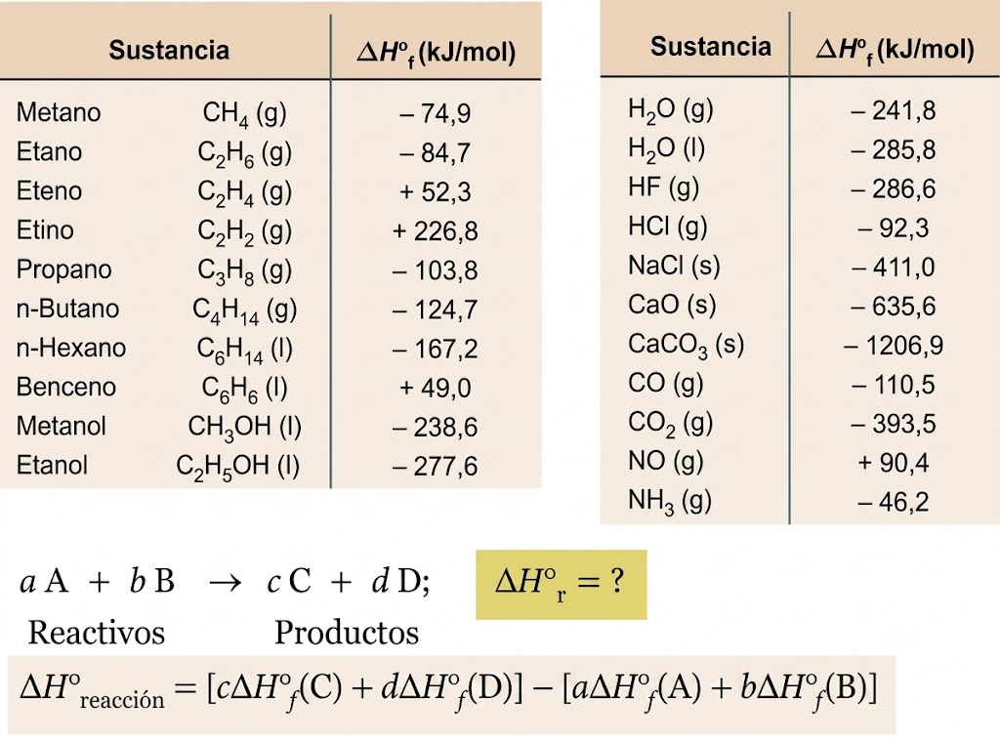{style="display: block; margin: left; width: 80%; height: 400px; border: 1px solid #333;"}

**3. Cálculo a partir de la ley de Hess**

La variación de entalpía que se produce cuando ocurre una determinada reacción es la misma tanto si ésta se produce en una sola etapa, como en varias etapas.

Cuando una reacción química puede expresarse como suma algebraica de otras, su $\ce{\Delta H}$ reacción es igual a la misma suma algebraica de las $\ce{\Delta H}$ de las reacciones parciales.

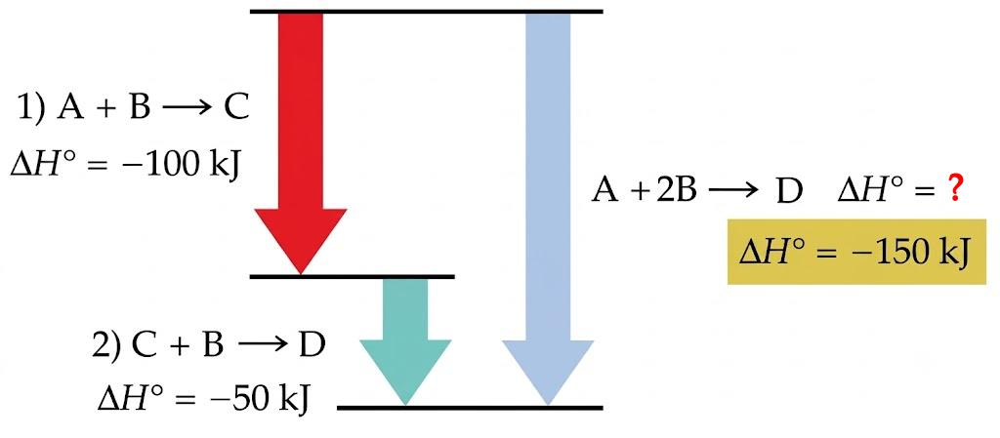{style="display: block; margin: left; width: 60%; height: 250px; border: 1px solid #333;"}

**Ejercicio de la ley de Hess**

Halla la entalpía de formación del amoniaco a partir de las siguientes ecuaciones:

$\ce{1) 2 H2 (g) + N2 (g) \rightarrow N2H4 (g) \hspace{1.4cm} \Delta H^{\circ}_1 = + 95,4 kJ}$

$\ce{2) N2H4 (g) + H2 (g) \rightarrow 2 NH3 (g) \hspace{1cm} \Delta H^{\circ}_2 = - 187,6 kJ}$

**Solución**:

La entalpía de reacción (formación del $\ce{NH3}$) que nos piden es de la siguiente reacción: 

$\ce{\hspace{3cm} 3 H2 (g) + N2 (g) \rightarrow 2 NH3 (g) \hspace{1.4cm} \Delta H^{\circ}_r = ?}$

Aplicando la ley de Hess, si sumamos las dos reacciones dadas obtenemos la ecuación buscada. 

$$
\begin{aligned}
&\text{Etapa 1.} \quad \ce{2 H2 (g) + N2 (g) \rightarrow \cancel{\ce{N2H4}} (g)} \hspace{1.4cm} \Delta \ce{H}^{\circ}_1 = + 95,4 \text{ kJ} \\[0.1cm]
&\text{Etapa 2.} \quad \ce{\cancel{\ce{N2H4}} (g) + H2 (g) \rightarrow 2 NH3 (g)} \hspace{1cm} \Delta \ce{H}^{\circ}_2 = - 187,6 \text{ kJ} \\[0.1cm]
\hline \\[-0.05cm]
&\text{Reacción} \quad \ce{3 H2 (g) + N2 (g) \rightarrow 2 NH3 (g)} 
\end{aligned}
$$

$\ce{\Delta H^{\circ}_{reacción} = \Delta H^{\circ}_1 + \Delta H^{\circ}_2 = + 95,4 kJ + (- 187,6 kJ) = - 92,2 kJ }$

Pero en ella se forman 2 mol de $\ce{NH3}$ por lo tanto, la entalpía de formación del $\ce{NH3}$ sería: $\ce{- 92,2 / 2 = - 46,1 kJ/mol}$

La ley de Hess permite tratar las ecuaciones termoquímicas como ecuaciones algebraicas, pudiendo sumarlas, restarlas o multiplicarlas por un número, junto a las entalpías de reacción correspondientes.

**4. Cáculo a partir de la entalpía de enlace**

La **entalpía de enlace** es un **valor medio de la energía** que se requiere para romper **1 mol de dichos enlaces**.

Cuanto **mayor** sea la **energía de enlace**, **más fuerte y más estable** será dicho enlace.

Una **reacción** consiste en una **reordenación de los átomos** de los reactivos para formar los productos. Esto supone la **ruptura de ciertos enlaces** y la **formación de otros nuevos**.

La energía intercambiada en ese proceso de ruptura y formación de enlaces es otra forma de determinar “aproximadamente” la entalpía de una reacción $\ce{\Delta H_r}$:

$\ce{\Delta H^{\circ}_{reacción} = \sum (energía de enlaces rotos) - \sum (energía de enlaces formados)}$
{ style="border: 2px solid #34077d; border-radius: 12px; padding: 15px; text-align: center; max-width: 700px; margin: 20px auto; display: block; background: #f9f7fb" }

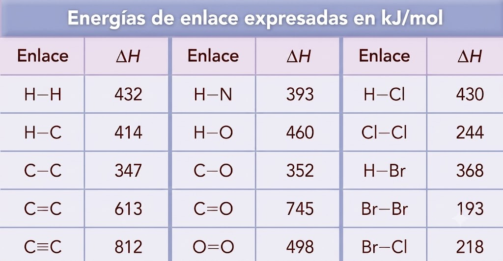{style="display: block; margin: 0 auto; width: 70%; border: 1px solid #333;"}

**Ejercicio de la entalpía de enlace**

Calcula la entalpía estándar de la reacción de combustión del metanol:

$\ce{\hspace{5cm} CH3OH + 3/2 O2 \rightarrow CO2 + 2 H2O}$

a partir de los datos de entalpías de enlace (kJ/mol): $\ce{C-H = 414; C-O = 352; O=O = 498; O-H = 460; C=O = 745}$

**Solución**:

<!--
##latex id=combustion_metanol sep=2em
\schemestart[0, 0.8, 1.5]
	\subscheme{
		\chemfig{C(-[2]H)(-[4]H)(-[6]H)-O-H} 
        \hspace{2em}
		+ \hspace{2em} 3/2
        \hspace{1em}
		\chemfig{O = O}
        \hspace{2em}
		\arrow{->}[0,1] 
        \hspace{2em}
    \chemfig{O = C = O} 
        \hspace{2em}
    + \hspace{2em} 2 
      \hspace{1em}
    \chemfig{H - O - H} 
		}
\schemestop
-->

{style="display: block; margin: 0 auto; width: 100%"}

$$
\begin{array}{ll}
\textbf{Enlaces que se rompen} & \textbf{Enlaces que se forman} \\
\ce{3 enlaces C-H} & \ce{dos enlaces C=O} \\
\ce{1 enlace C-O} & \ce{cuatro enlaces O-H} \\
\ce{1 enlace O-H} & \\
\ce{3/2 enlace O=O} & \\
\end{array}
$$

Aplicando la expresión:

$\ce{\Delta H^{\circ}_{reacción} = \sum (energía de enlaces rotos) - \sum (energía de enlaces formados)}$

$\ce{\Delta H^{\circ}_{reacción} = (3 mol \cdot 414 kJ/mol + 1 mol \cdot  352 kJ/mol + 1 mol \cdot 460 kJ/mol + }$ 

$\ce{\hspace{2cm} + 3/2 mol \cdot 498 kJ/mol) - (2 mol \cdot 745 kJ/mol + 4 mol \cdot 460 kJ/mol)}$

$\ce{\Delta H^{\circ}_{reacción} = - 529 kJ }$

## **05. Segundo principio y Entropía**

El primer principio establece que cuando un sistema experimenta una transformación, se cumple que:

$\ce{\hspace{3cm} \Delta U = Q + W}$

La energía total se conserva, pero hay procesos:

- **Espontáneos**: se producen sin ninguna intervención externa

- **No espontáneos**: se dan gracias a una acción externa continua

En principio, puede parecer que solo los procesos exotérmicos son espontáneos, pero hay procesos endotérmicos que también lo son.

Para predecir en qué sentido un sistema va a evolucionar de forma espontánea, el primer principio no es suficiente, solo $\ce{\Delta H}$ no sirve para determinar la espontaneidad, necesitamos una nueva magnitud física: **ENTROPÍA**

**Concepto de entropía: S**

La **entropía** mide el **grado de desorden de un sistema a nivel molecular**

- Es una magnitud extensiva y función de estado

- Se mide en J/K

- $\ce{S_{gas} > S_{líquido} >S_{sólido}}$

- La entropía de un sistema aumenta con la temperatura.

Cuando un sistema intercambia energía con el entorno, la variación de entropía, depende del calor intercambiado y de la temperatura a la que se produce el intercambio.

$\ce{\Delta S = \dfrac {Q}{T} }$
{ style="border: 2px solid #34077d; border-radius: 12px; padding: 15px; text-align: center; max-width: 110px; margin: 20px auto; display: block; background: #f9f7fb" }

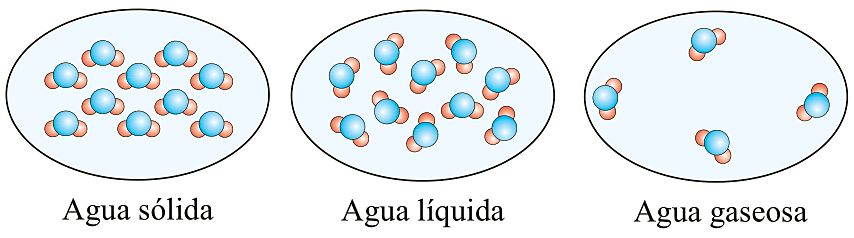{style="display: block; margin: 0 auto; width: 70%; border: 1px solid #333;"}

**Segundo principio de la termodinámica**

- Plantea la imposibilidad de que puedan producirse ciertos procesos.

- Conecta la entropía y la espontaneidad de un proceso

Un **sistema evoluciona de forma espontánea** si la **entropía del universo aumenta** con esa transformación.

$\ce{\Delta S_{universo} > 0 }$
{ style="border: 2px solid #34077d; border-radius: 12px; padding: 15px; text-align: center; max-width: 180px; margin: 20px auto; display: block; background: #f9f7fb" }

$\ce{\hspace{6cm} \Delta S_{universo} = \Delta S_{sistema} + \Delta S_{entorno}}$

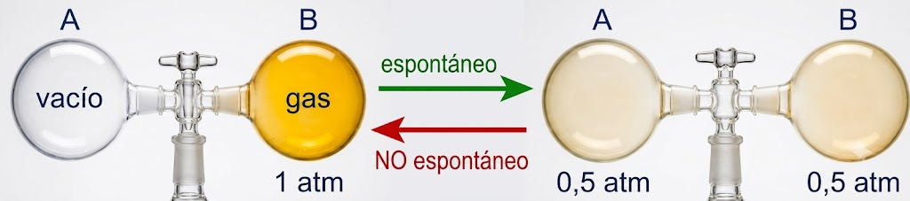{style="display: block; margin: 0 auto; width: 90%; border: 1px solid #333;"}

El **gas se distribuye uniformemente** entre ambos matraces; pero **NO se da el proceso inverso**: que un gas encerrado en 2 matraces se concentre espontáneamente en uno solo.

**La entropía y el segundo principio**

$\ce{\Delta S_{universo} = \Delta S_{sistema} + \Delta S_{entorno}}$
{ style="border: 2px solid #34077d; border-radius: 12px; padding: 15px; text-align: center; max-width: 300px; margin: 20px auto; display: block; background: #f9f7fb" }

**Reacción exotérmica**

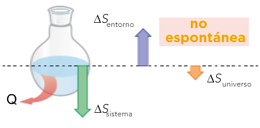{style="display: block; margin: 0 auto; width: 50%; border: none;"}

- La **espontaneidad** de los procesos **exotérmicos** depende de cómo varíe la $\ce{\Delta S}$ del **sistema**.

**Reacción endotérmica**

  

    

      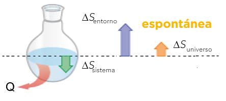
    

  

  

    

      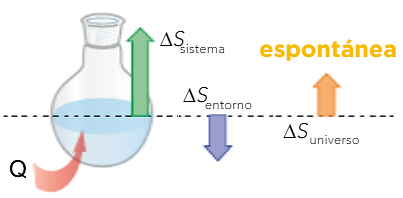
    

  

- La **espontaneidad** de los procesos **endotérmicos** depende de cómo varíe la $\ce{\Delta S}$ del **entorno**.

**Variacción de entropía en una reacción**

El **tercer principio** de la Termodinámica establece que:

La **entropía de una sustancia pura** (elemento o compuesto) que se halle como un cristal perfecto a **0 K es cero**

La **entropía nunca puede ser negativa** ya que 0 K es la temperatura más baja posible y a cualquier otra S > 0

Si puede haber $\ce{\Delta S < 0}$

A partir de las tablas de entropías molares de las sustancias en condiciones estándar $\ce{S^{\circ}}$, la $\ce{\Delta S^{\circ}}$ de una reacción se calcula:

$\ce{\Delta S^{\circ}_{reacción} = \sum n_p \cdot S^{\circ} (productos) - \sum n_r \cdot S^{\circ} (reactivos)}$
{ style="border: 2px solid #34077d; border-radius: 12px; padding: 15px; text-align: center; max-width: 550px; margin: 20px auto; display: block; background: #f9f7fb" }

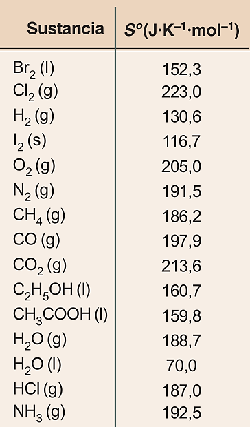{style="display: block; margin: 0 auto; width: 30%; border: 1px solid #333;"}

Para una reacción genérica dada sería:

$\ce{\hspace{5cm} a A + b B \rightarrow \; c C + d D}$

$\ce{\hspace{2cm} \Delta S^{\circ}_{reacción} =[c \cdot S^{\circ} (C) + d \cdot S^{\circ} (D)] - [a \cdot S^{\circ} (A) + b \cdot S^{\circ} (B)]}$

a, b, c y d están en mol

**Cómo averiguar el signo de la $\ce{\Delta S}$ de una reacción**

Para predecir el signo de la $\ce{\Delta S}$ de una reacción si el **número de partículas de gas** es mayor en los productos que en los reactivos $\ce{\Delta S > 0}$; si es menor $\ce{\Delta S < 0}$ y si no varía $\ce{\Delta S = 0}$

$\ce{C (s) +  \color{blue}{1/2 O2 (g)} \rightarrow \color{blue}{CO (g)} \hspace{2.3cm} \Delta S^{\circ} > 0}$

$\ce{CaCO3 (s) \rightarrow CaO (s) + \color{blue}{CO2 (g)} \hspace{1cm} \Delta S^{\circ} > 0}$

$\ce{\color{blue}{PCl3 (g)} + \color{blue}{Cl2 (g)} \rightarrow \color{blue}{PCl5 (g)} \hspace{1.6cm} \Delta S^{\circ} < 0 }$

## **06. Espontaneidad y Energía Libre**
   
**Energía libre de Gibbs**

Para salvar la dificultad de tener que determinar la $\ce{\Delta S_{universo}}$ para poder saber si una reacción es o no espontánea, se introduce una nueva magnitud: la **energía libre de Gibbs** (**G**)

$\ce{\hspace{5cm} G = H - T \cdot S}$

Es una función de estado y en el S.I. se mide en **Julios** (J)

T = temperatura en K. No podemos conocer su valor absoluto pero si su variación, que en condiciones de p y T constantes es:

$\ce{\Delta G = \Delta H - T \cdot \Delta S}$
{ style="border: 2px solid #34077d; border-radius: 12px; padding: 15px; text-align: center; max-width: 200px; margin: 20px auto; display: block; background: #f9f7fb" }

&#10071; Un **proceso es espontáneo** si $\ce{\Delta G < 0}$

Si $\ce{\Delta G > 0}$ el proceso **no es espontáneo**

Si $\ce{\Delta G = 0}$ el sistema está en **equilibrio**

**Variacion de la energía libre de Gibbs en una reacción química**

Se puede calcular a partir de la variación de entalpía estándar de reacción  y de la variación de entropía estándar de la reacción:

$\ce{\Delta G^{\circ}_r = \Delta H^{\circ}_r - T \cdot \Delta S^{\circ}_r}$
{ style="border: 2px solid #34077d; border-radius: 12px; padding: 15px; text-align: center; max-width: 230px; margin: 20px auto; display: block; background: #f9f7fb" }

También se puede hallar a partir de las energías libres de formación de reactivos y productos, usando la ley de Hess.

$\ce{\Delta G^{\circ}_r = \sum n_p \cdot \Delta G^{\circ}_f (productos) - \sum n_r \cdot \Delta G^{\circ}_f (reactivos)}$
{ style="border: 2px solid #34077d; border-radius: 12px; padding: 15px; text-align: center; max-width: 550px; margin: 20px auto; display: block; background: #f9f7fb" }

Para la reacción: $\quad \ce{\text{a} A + \text{b} B \rightarrow \text{c} C + \text{d} D}$

$\ce{\hspace{2cm} \Delta G^{\circ}_r = (c \cdot \Delta G^{\circ}_f C + d \cdot \Delta G^{\circ}_f D) - (a \cdot \Delta G^{\circ}_f A + b \cdot \Delta G^{\circ}_f B)}$

Cuanto más negativo es el valor de la energia libre de Gibbs, más estable es la especie química formada y más espontánea es la reacción.

La energía libre de Gibbs estándar de formación de un elemento químico en su estado más estable (natural) es 0, al igual que ocurría con la entalpía estandar de formación ($\ce{N2(g)}$, $\ce{Br2(l)}$, Fe(s)...)

**Espontaneidad de las reacciones**

Partiendo de la ecuación de la energía libre de Gibbs, $\ce{\Delta G = \Delta H - T \cdot \Delta S}$, se puede deducir que:

- Si en una **reacción exotérmica** ($\ce{\Delta H < 0}$) se produce un aumento de la entropía ($\ce{\Delta S > 0}$), tendremos que $\ce{\Delta G < 0}$ y, por tanto, el proceso es **espontáneo**.
  
- Pero hay reacciones en las que los términos entálpico ($\ce{\Delta H}$) y entrópico ($\ce{T \cdot \Delta S}$) están enfrentados; en estos casos, decide el valor de la temperatura, $\ce{T}$, a la que se realiza el proceso, ya que va a determinar si ($\ce{T \cdot \Delta S}$) es más o menos negativo y por tanto si favorece o no la espontaneidad de la reacción.

Por ejemplo, el carbonato de amonio se descompone desprendiendo un fuerte olor a amoniaco, según la reacción:

$\ce{\hspace{2cm} (NH4)2CO3 (s) \rightarrow NH4HCO3 (s) + NH3 (g) \hspace{1cm} \Delta H = 40,2 kJ}$

Esta reacción es endotérmica ($\ce{\Delta H > 0}$) y transcurre con un aumento de la entropía ($\ce{\Delta S > 0}$), luego solo será **espontánea** ($\ce{\Delta G < 0}$) a **temperaturas altas**; cuando se cumpla que: $\ce{|T \cdot \Delta S| > |\Delta H|}$

**Evaluación de la espontaneidad**

Influencia de la temperatura en la espontaneidad de una reacción química:

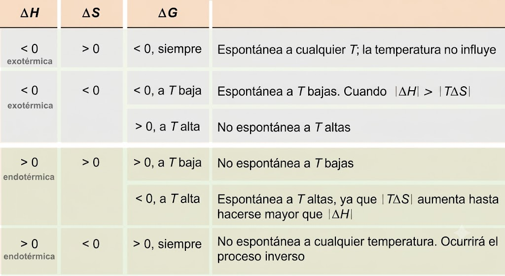{style="display: block; margin: 0 auto; width: 90%; border: 1px solid #333;"}
