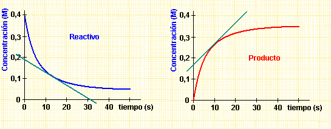
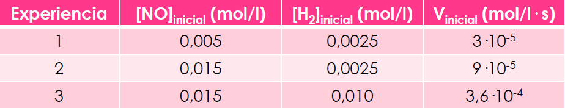
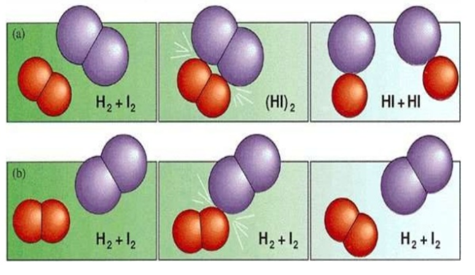
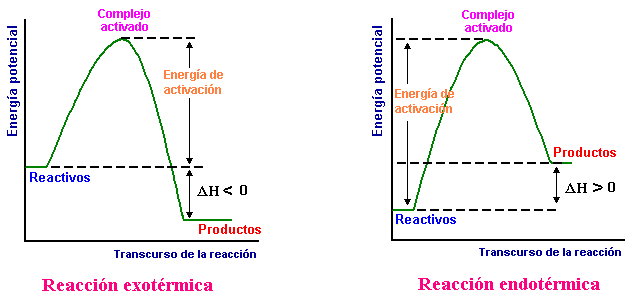
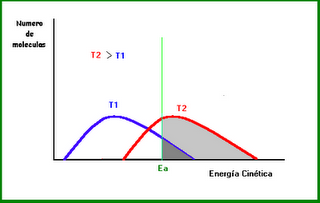
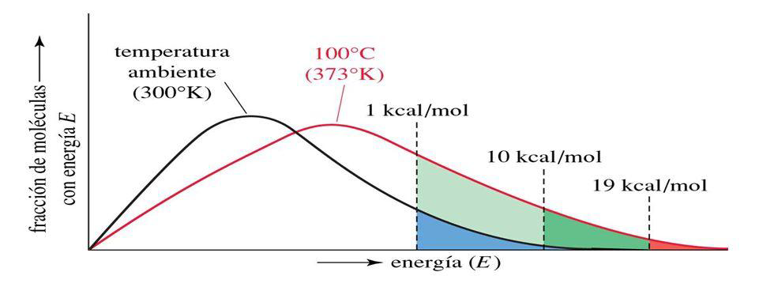
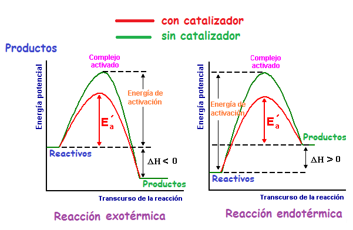
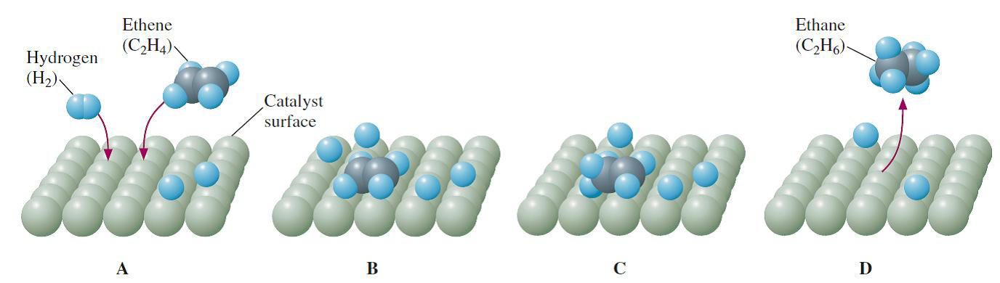

# Tema 4: Cinética química

## **1. Introducción**

Para que una reacción química tenga lugar no sólo es necesario que esté favorecida termodinámicamente, sino que además, es necesario que se dé a una velocidad suficiente (ej. combustión de un papel)

En algunos casos interesa acelerar las reacciones químicas, como en los procesos industriales de fabricación de productos. En otras ocasiones interesa retardar los procesos, como en la conservación de alimentos.

La **cinética química** estudia la velocidad a la que ocurren las reacciones químicas y los factores, las leyes y teorías que la determinan.

En este tema estudiaremos la velocidad en la que ocurren las reacciones, los factores que modifican dicha velocidad y las teorías que permiten explicar dichos factores. Veremos los distintos tipos de catalizadores y su mecanismo de actuación, así como algunas de sus aplicaciones industriales.

## **2. Velocidad de reacción**

En una reacción química los reactivos desaparecen progresivamente en el transcurso de la reacción, mientras que los productos aparecen. La velocidad de reacción permite medir cómo varían las cantidades de reactivos y productos a lo largo del tiempo.

Utilizando la concentración como medida de la cantidad de sustancia se define la velocidad de reacción como la variación de concentración de reactivo o producto por unidad de tiempo.

Para una reacción genérica expresada por: $\ce{\quad \quad \text{a A + b B} \rightarrow \text{c C + d D}}$

definimos la velocidad de reacción como:

$$\ce{\textrm{v}_A = - \dfrac {\ce{d[A]}}{\ce{dt}}} \hspace{1.5cm} \ce{\textrm{v}_B = - \dfrac {\ce{d[B]}}{\ce{dt}}}$$

Puesto que los reactivos desaparecen será negativa y por tanto la definición implica un valor positivo de la velocidad de reacción.

En las curvas de la figura se observa cómo la pendiente de la recta tangente a la curva correspondiente al reactivo A es negativa, mientras la pendiente de la curva del producto C es positiva.

{style="display: block; margin: 0 auto; width: 90%; border: 1px solid #333;"}

La velocidad de una reacción en un instante dado es igual a la pendiente de la recta tangente a la curva concentración-tiempo, en el punto correspondiente a ese instante.

En el S.I. las **unidades** de la **velocidad de reacción** son 

$$\ce{mol \cdot l^{-1} \cdot s^{-1}}$$

Definida de esta manera, y dado el ajuste de la reacción, se hace evidente que estas velocidades no son iguales, dado que dependen del coeficiente estequiométrico, pudiendo afirmarse:

$$\ce{\textrm{v} = - \dfrac {\ce{1}}{\ce{a}} * \dfrac {\ce{d[A]}}{\ce{dt}} = - \dfrac {\ce{1}}{\ce{b}} * \dfrac {\ce{d[B]}}{\ce{dt}} =  \dfrac {\ce{1}}{\ce{c}} * \dfrac {\ce{d[C]}}{\ce{dt}} = \dfrac {\ce{1}}{\ce{d}} * \dfrac {\ce{d[D]}}{\ce{dt}}}$$

**Ecuación de velocidad**

La velocidad de reacción se obtiene experimentalmente. A partir de las velocidades iniciales de reacción para los reactivos y variando sus concentraciones iniciales, se puede determinar la expresión matemática que relaciona la velocidad con las concentraciones. Esta expresión se conoce como **ley diferencial de velocidad** o **ecuación de velocidad**.

$$\ce{\textrm{v} = k * [A]^{\alpha} * [B]^{\beta}}$$

Los exponentes $\alpha$ y $\beta$ se denominan **órdenes parciales** de reacción.

La **suma** $\alpha$ + $\beta$ se llama **orden total** de reacción.

Aunque en algunas reacciones simples $\alpha$ y $\beta$ podrían coincidir con los coeficientes estequimétricos, en general no es así, y deben determinarse experimentalmente.

La constante k se denomina **constante de velocidad**. Su valor es característico de cada reacción y depende de la temperatura de reacción. Las unidades de la constante deben deducirse de la expresión experimental obtenida para la velocidad de reacción.

**Ejemplo. PAU Madrid**

La velocidad de la reacción $\ce{A + 2 B \rightarrow C}$ en fase gaseosa sólo depende de la temperatura y de la concentración de A, de tal manera que si se duplica la concentración de A la velocidad de reacción también se duplica.

a) Justifica para qué reactivo cambia más deprisa la concentración.

b) Indica los órdenes parciales respecto de A y B y escribe la ecuación cinética.

c) Indica las unidades de la velocidad de reacción y de la constante cinética.

d) Justifica cómo afecta a la velocidad de reacción una disminución de volumen a temperatura constante.

**SOLUCIÓN**

a) Justifica para qué reactivo cambia más deprisa la concentración.

Puesto que de la estequiometría de la reacción se desprende que por cada mol de A que reacciona se consumen 2 moles de B, para éste reactivo se produce un cambio de concentración más rápido.

b) Indica los órdenes parciales respecto de A y B y escribe la ecuación cinética.

Si la velocidad de reacción sólo depende de la concentración del reactivo A, aparte de también depender de la temperatura, y se duplica su valor al duplicar la concentración de A, el orden de reacción respecto a éste reactivo es 1. La ecuación cinética de la reacción es: 

$$\ce{\textrm{v} = k \cdot [A]}$$

c) Indica las unidades de la velocidad de reacción y de la constante cinética.

Las unidades de la velocidad de reacción son $\ce{mol \cdot L^{-1} \cdot s^{-1}}$. Despejando de la ecuación cinética la constante de velocidad, sustituyendo las variables que
se conocen por sus unidades y operando, se obtienen las unidades de dicha
constante:

$$\ce{k = \dfrac {\ce{\textrm{v}}}{\ce{[A]}} = \dfrac {\ce{mol * L^{-1} * s^{-1}}}{\ce{mol * L^{-1}}} = s^{-1}}$$

d) Justifica cómo afecta a la velocidad de reacción una disminución de volumen a temperatura constante.

Si la temperatura se mantiene constante, la velocidad de reacción depende únicamente de la concentración de A, y como al disminuir el volumen se produce un aumento de la concentración de este reactivo, la velocidad de la reacción experimenta un aumento de valor.

**OTRO EJEMPLO**

En la reacción $\ce{2 NO + 2 H2 \rightarrow N2 + 2 H2O}$, a 1100 K, se obtuvieron los siguientes datos:

{style="display: block; margin: 0 auto; width: 70%; border: 1px solid #333;"}

Calcula el orden de reacción y el valor de la constante de velocidad.

**Solución**:

En este tipo de ejercicios en los que se nos presentan en una tabla datos de concentraciones iniciales y de velocidades para diferentes experimentos hemos de comparar, de dos en dos, experiencias en las que cambia la concentración de uno de los reactivos mientras que la del otro permanece constante.

Así, entre las experiencias 1 y 2 la concentración de $\ce{H2}$ permanece constante y cambia la de $\ce{NO}$, por lo que de ahí podremos sacar el orden de reacción respecto del $\ce{NO}$.

Se ve que al triplicar la concentración de $\ce{NO}$ se triplica la velocidad, por lo que el orden de $\ce{NO}$ será 1.

El razonamiento anterior se puede hacer matemáticamente.

La ecuación de velocidad genérica será: $\ce{\quad \textrm{v} = k \cdot [NO]^{\alpha} \cdot [H2]^{\beta}}$

Sustituyendo los datos de las dos primeras experiencias:

$\ce{3\cdot10^{-5} = k \cdot (0,005)^{\alpha} \cdot (0,0025)^{\beta} \quad \quad (1)}$

$\ce{9\cdot10^{-5} = k \cdot (0,015)^{\alpha} \cdot (0,0025)^{\beta} \quad \quad (2)}$

Dividiendo 2 entre 1:

$\ce{\dfrac {(2)}{(1)} \quad \quad \dfrac {9\cdot10^{-5}}{3\cdot10^{-5}} = \dfrac {k \cdot (0,015)^{\alpha} \cdot (0,0025)^{\beta}}{k \cdot (0,005)^{\alpha} \cdot (0,0025)^{\beta}} }$

Se obtiene $\ce{3 = 3^{\alpha}}$ de donde se deduce que $\ce{\alpha \; = 1}$

Lo mismo se hace para averiguar el valor de $\beta$ usando las experiencias 2 y 3:

$\ce{9\cdot10^{-5} = k \cdot (0,015)^{\alpha} \cdot (0,0025)^{\beta} \quad \quad (2)}$

$\ce{3,6\cdot10^{-4} = k \cdot (0,015)^{\alpha} \cdot (0,010)^{\beta} \quad \quad (3)}$

Dividiendo 3 entre 2:

$\ce{\dfrac {(3)}{(2)} \quad \quad \dfrac {3,6\cdot10^{-4}}{9\cdot10^{-5}} = \dfrac {k \cdot (0,015)^{\alpha} \cdot (0,010)^{\beta}}{k \cdot (0,015)^{\alpha} \cdot (0,0025)^{\beta}} }$

Se obtiene $\ce{4 = 4^{\beta}}$ de donde se deduce que $\ce{\beta \; = 1}$

El orden total será: $\ce{\quad \alpha \; + \beta \; = 1 + 1 = 2}$

Y la ecuación de velociadad será: $\ce{\quad \textrm{v} = k \cdot [NO] \cdot [H2]}$

La constante k que nos piden la podemos obtener de cualquiera de las tres experiencias sustituyendo los valores y despejando.

Por ejemplo, de la segunda: 

$\ce{9 \cdot 10^{-5} = k \cdot (0,015)^1 \cdot (0,0025)^1}$; despejando

$\ce{k = \dfrac {9 \cdot 10^{-5}}{0,015 \cdot 0,0025} = 2,4 \; mol^{-1}\cdot l\cdot s^{-1}}$

## **3. Mecanismo de reacción**

Se llama **mecanismo de reacción** al proceso a través del cual transcurre una reacción.

Una reacción es **elemental** cuando el transcurso de la misma puede representarse mediante una sola ecuación estequiométrica, es decir, se realiza en una sola etapa.

En las reacciones **elementales** (y solo en ellas) se denomina **molecularidad** al **número de moléculas que intervienen** en el proceso. En ellas, los **órdenes de reacción** coinciden con los **coeficientes estequiométricos**.

Supongamos que la reacción $\ce{A + 2 B \rightarrow AB2}$ es elemental.

En este caso $\ce{\textrm{v} = k \cdot [A]^1 \cdot [B]^2}$, y significa que se produce en un solo choque de tres moléculas: una de A y dos de B.

Una reacción es **compleja** cuando el transcurso de la misma se representa por **varias ecuaciones estequiométricas**, las cuales representan **varias etapas**.

Supongamos ahora que para la reacción global $\ce{\quad A + 2 B \rightarrow AB2}$

La ecuación cinética es: $\ce{\textrm{v} = k \cdot [A]^1 \cdot [B]^1}$, como vemos, los órdenes de reacción no coinciden con los coeficientes estequiométricos. Eso es una **pista** para saber que la **reacción es compleja** y transcurre a través de **varias etapas**, que podrían ser:

$$\ce{A + B \rightarrow AB \quad \quad \quad Etapa 1}$$

$$\ce{AB + B \rightarrow AB2 \quad \quad  Etapa 2}$$ 

Si por ejemplo la 1ª etapa es la más lenta, será ella la que determine la velocidad total de la reacción, presentando la ecuación de velocidad de orden total 2 (1+1) vista anteriormente.

A la **etapa lenta**, que **determina la velocidad de reacción**, se la conoce como “**etapa limitante**”.

**Ejemplo de mecanismo**

Para la reacción de oxidación del bromuro de hidrógeno:

$$\ce{4 HBr (g) + O2 (g) \rightarrow 2 Br2 (g) + 2 H2O (g)}$$

Si el proceso se verificara en una sola etapa, la velocidad vendría dada por la expresión: $\ce{\textrm{v} = k \cdot [HBr]^4 \cdot [O2]}$

Sin embargo, se ha obtenido experimentalmente un orden de reacción dos para la ecuación de velocidad: 

$$\ce{\textrm{v} = k \cdot [HBr] \cdot [O2]}$$

Si el proceso se realizara según la ecuación de reacción sería necesario el choque simultáneo de cuatro moléculas de HBr y una de $\ce{O2}$, cosa prácticamente imposible. Por eso se ha propuesto un mecanismo en varias etapas:
 
$$\ce{HBr + O2 \rightarrow HBrOO \hspace{3.2cm} \textbf{lenta}}$$

$$\ce{ HBrOO + HBr \rightarrow 2 HBrO \hspace{2.3cm} rápida}$$

$$\ce{ 2 HBrO + 2 HBr \rightarrow 2 H2O + 2 Br2 \hspace{0.8cm} rápida}$$

Se observa que en todos los procesos son necesarios dos moléculas para verificarse y que la primera reacción de la cadena es lenta, determinando por tanto la velocidad global de la reacción.

## **4. Teoría de las colisiones**

En una **reacción química** se rompen enlaces de las moléculas de reactivos y se forman nuevos enlaces, dando lugar a las moléculas de los productos. Este **proceso** implica que **las moléculas reaccionantes entren en contacto**, es decir, **choquen**. Esta idea constituye la base de las distintas teorías de las reacciones químicas.

La **teoría de colisiones** fue enunciada por Lewis en 1918.

Según esta teoría para que las moléculas de dos reactivos reaccionen se debe producir un choque entre ellas. Ahora bien, dos moléculas pueden chocar entre si y no dar lugar a reacción alguna. Para que esto ocurra, el choque sea eficaz, debe cumplirse además:

1. Que las **moléculas posean** **suficiente energía cinética**, para que al chocar puedan romperse algunos enlaces. Las **moléculas** que cumplen esta condición se dice que están **activadas** y la **energía mínima** requerida se denomina **energía de activación**.
   
2. Que el **choque** se verifique en una **orientación adecuada**, para que sea eficaz.

{style="display: block; margin: 0 auto; width: 60%; border: 1px solid #333;"}

En el dibujo de arriba se aprecian dos tipos de choque:

- En el superior la orientación es adecuada, y dará lugar a dos moléculas de HI.

- En el inferior la orientación no es adecuada. Será un choque ineficaz y no dará lugar a la formación de HI.
  

## **5. Teoría del estado de transición (complejo activado)**

Esta teoría, complementaria a la de las colisiones, admite que la reacción transcurre con la formación de un complejo molecular en el cual aún no se han roto los enlaces de las moléculas reaccionantes y tampoco se han formado los enlaces de los compuestos resultantes.

A ese estado se le llama **estado de transición**, y al complejo molecular, **complejo activado**.

En el ejemplo de abajo (sustitución del I por OH para dar metanol a partir de yodometano) se especifica el complejo activado entre corchetes.

<!--
##latex id=yodometano sep=2em
\schemestart[0, 0.8, 1.5]
    \chemfig{H\charge{45:2pt=$\ominus$}{O}} + \ce{CH3I} \; $\longrightarrow$ \; $\left[ \quad \chemfig{[,1] \charge{35:6pt=$\delta\oplus$}{C}(-[:180,1.25,,,dotted]H\charge{45:4pt=$\delta\ominus$}{O})(-[:230]H)(-[:310]H)(-[:90]H)(-[:0,1.25,,,dotted]\charge{45:6pt=$\delta\ominus$}{I}) } \quad \quad \right]^{\verteq} $ \; $\rightarrow$ \; \ce{HOCH3} + \chemfig{\charge{45:2pt=$\ominus$}{I} \;}
\schemestop
-->

{style="display: block; margin: 0 auto; width: 60%"}

El complejo activado es muy inestable debido a la alta Ep que contiene (Energía de activación proveniente de la Ec de las moléculas reaccionantes), y tiende a evolucionar a un estado de menor energía, desprendiendo ésta.

Según sea el valor de la energía desprendida, con respecto a la energía de activación, tendremos un proceso **exotérmico** o **endotérmico**.

{style="display: block; margin: 0 auto; height: 300px ;width: 80%; border: 1px solid #333;"}

**Energía de activación**

En 1899 Arrhenius propuso un interpretación cuantitativa de la variación de la velocidad de reacción con la temperatura. Propuso para la constante específica de velocidad la siguiente expresión:

$$\ce{k = A \cdot e^{ $\frac {\ce{-Ea}}{\ce{R \cdot T}}$ } }$$

siendo **R** la **constante de los gases**, **A** una constante llamada **factor de frecuencia** y **Ea** la **energía de activación**.

Esta ecuación puede interpretarse de acuerdo con la teoría del complejo activado.

El **factor de frecuencia A** mide el **número de choques con la orientación adecuada**, mientras que $\text{e}^{ \frac {\ce{-Ea}}{\ce{R \cdot T}} }$ determina la **fracción de moléculas que superan la energía de activación**.

## **6. Influencia de la temperatura en la velocidad de reacción**

La ecuación de Arrhenius es coherente con lo observado experimentalmente: la velocidad de las reacciones químicas aumenta con la temperatura. Lógico, ya que al aumentar T, aumenta la energía cinética media, (Ecm) de las moléculas, con lo que aumentará el número de choques eficaces.

{style="display: block; margin: 0 auto; height: 300px ;width: 80%; border: 1px solid #333;"}

**Efecto de la temperatura en la velocidad de una reacción**

La gráfica muestra cómo el número de moléculas que tienen una determinada energía de activación disminuye a medida que la energía de activación aumenta. A **temperatura más alta** (curva roja), la **proporción de moléculas con la energía suficiente** para producir colisiones eficaces es **más alta**.

{style="display: block; margin: 0 auto; height: 300px ;width: 80%; border: 1px solid #333;"}

**Constante de velocidad a diferentes temperaturas**

Si tomamos logaritmos en la ecuación de Arrhenius:

$$\ce{ln k = ln A - \dfrac {\ce{Ea}}{\ce{R \cdot T}}}$$

Que expresada para dos temperaturas diferentes $\ce{T_1}$ y $\ce{T_2}$:

$$\ce{ln \; k1 = ln \; A - $\dfrac {\ce{E_a}}{\ce{R*T1}}$} \hspace{3cm} \ce{ln \; k2 = ln \; A - $\dfrac {\ce{E_a}}{\ce{R*T2}}$}$$

Si las restamos miembro a miembro:

$$\ce{ln \; \dfrac {\ce{k2}}{\ce{k1}} = - \dfrac {\ce{E_a}}{\ce{R}} * $\left( \dfrac {\ce{1}}{\ce{T2}} - \dfrac {\ce{1}}{\ce{T1}} \right)$ }$$

Ecuación que nos permite **calcular la energía de activación de una reacción química** si conocemos las constantes de velocidad a diferentes temperaturas.

**Influencia de la concentración y la presión**

De acuerdo con la teoría de colisiones, para que se produzca una reacción química tienen que chocar entre sí las moléculas reaccionantes. El número de choques será proporcional a la concentración de cada uno de los reactivos.

Este hecho viene recogido en la expresión de la ecuación de velocidad, ya que ésta es proporcional a las concentraciones elevadas a su orden de reacción.

$$\ce{\textrm{v} = k \cdot [A]^{\alpha} \cdot [B]^{\beta}}$$

En **reacciones entre gases** si **aumentamos la presión** también **aumentaremos** los choques entre las moléculas y con ello **la velocidad de reacción**.

En aquellas **reacciones** donde se **aplica un exceso de reactivo**, aunque no se consiga aumentar la cantidad total de producto, se consigue un **aumento de velocidad** al haber una **mayor concentración de reactivo**.

**Efecto del grado de división de los reactivos**

En las **reacciones heterogéneas**, donde los **reactivos** están en **diferentes fases**, la reacción se produce en la superficie de contacto. En estos casos **la velocidad de reacción dependerá del área de dicha superficie**.

En el caso de un **reactivo sólido**, la **velocidad** **aumentará** cuanto **mayor** sea el **grado de división**. Así las reacciones pueden ser muy rápidas si los reactivos sólidos están finamente divididos.

Las condiciones más propicias para que **una reacción sea rápida** es que se verifique entre **gases** o en **disolución**, ya que entonces la **división** alcanza su **grado máximo**.

**Catálisis**

Un **catalizador** es una sustancia que, incluso en cantidades muy pequeñas, **modifica mucho la velocidad de una reacción**, sin sufrir ella misma ninguna alteración química permanente. Este fenómeno se denomina **catálisis**.

Aunque **el catalizador no se consume en la reacción** tiene un papel activo en la misma, ya que **cambia el mecanismo de la reacción**, proporcionando un mecanismo de reacción cuya **energía de activación es menor**.

{style="display: block; margin: 0 auto; height: 300px ;width: 70%; border: 1px solid #333;"}

**- Catálisis homogénea**

Cuando un **catalizador** se encuentra en la** misma fase que los reactivos**, se habla de **catálisis homogénea**.

Ejemplo: la descomposición del peróxido de hidrógeno transcurre lentamente, en condiciones normales; sin embargo cuando se le añade yoduro de potasio en disolución, ocurre a gran velocidad.

$$\ce{H2O2 (aq) \rightarrow H2O (l) + 1/2 O2 (g)}$$

Es necesario indicar que **un catalizador disminuye la energía de activación** también de la reacción inversa, pero no alteran en absoluto los valores de la entalpía y energía libre de la reacción. Por tanto **no altera el equilibrio químico**, tan **sólo disminuye el tiempo en alcanzar ese equilibrio**.

**Catálisis heterogénea**

En muchos procesos, sobre todo industriales, el **catalizador** se encuentra en una **fase distinta a la de los reactivos**. Se habla entonces de **catálisis heterogénea**.

En las reacciones catalizadas por catalizadores en estado sólido se produce la adsorción de las moléculas reactivas en unos puntos denominados puntos activos. Una vez las moléculas han quedado adsorbidas se produce una relajación de los enlaces y el choque con orientación adecuada de moléculas de los otros reactivos. Posteriormente se produce la desorción de los productos de reacción quedando el punto activo del catalizador libre para catalizar nuevamente el proceso.

{style="display: block; margin: 0 auto; height: 200px ;width: 80%; border: 1px solid #333;"}

Los catalizadores heterogéneos pueden ser metales de transición finamente divididos, óxidos de dichos metales o zeolitas. Este tipo de catalizadores son muy específicos, así para unos mismos reactivos el cambio de catalizador da lugar a la formación de productos diferentes.

Ciertas sustancias, llamadas **venenos**, **interfieren** e **inutilizan los catalizadores**, bastando pequeñas cantidades de veneno para que el **catalizador pierda su efectividad**.

**Catálisis enzimática**

Las **reacciones bioquímicas** están **catalizados** por sustancias denominadas **enzimas**. Las enzimas son proteínas de elevado peso molecular y con una conformación determinada.

En la catálisis enzimática **el reactivo**, llamado **sustrato**, **encaja perfectamente** en un punto específico de la superficie de la enzima, tal como una **llave a la cerradura**. Una vez unida al sustrato la enzima cambia su configuración rompiendo así los enlaces del sustrato, produciéndose la reacción y liberándose los productos.

Las **enzimas presentan** una **gran especificidad** tanto respecto a los sustratos como a los productos. Esto es, cada enzima se une a un determinado sustrato y no a otro, a su vez cada enzima da lugar a unos determinados productos.

Las enzimas presentan además una **elevada actividad**.

---

[Descargar Tema 4 en PDF](../pdfs/tema4-cinetica/tema4-cinetica.pdf){ .md-button .md-button--primary }