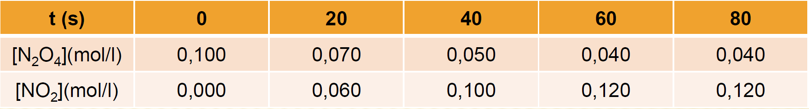
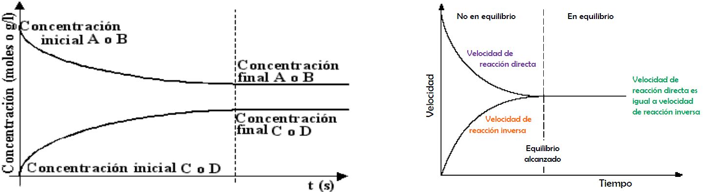
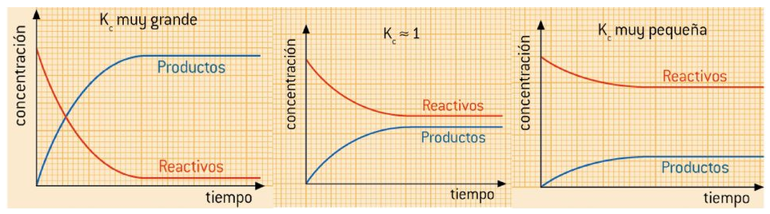

# Tema 5 Equilbrio químico

## **1. Concepto de equilibrio químico**

Con frecuencia, los productos que se forman en una reacción química comienzan a reaccionar entre sí para volver a dar los reactivos originales. A estas reacciones se las llama **reversibles**, y se significan con una **doble flecha** entre productos y reactivos:

$$\ce{a A + b B \leftrightarrows c C + d D}$$

Se suele denominar **proceso directo** al que va de izquierda a derecha, y **proceso inverso** al que va de derecha a izquierda.

Se dice que se ha **alcanzado el equilibrio químico** cuando la **velocidad** a la que ocurre el **proceso directo es igual** a la que se produce el **inverso**. De manera que la cantidad global de A, B, C y D permanece constante en el tiempo, aunque **la reacción química no se para en ningún momento**. Por eso se habla de “**equilibrio dinámico**”.

Ejemplo: $\ce{\quad N2O4 (g) \leftrightarrows 2 NO2 (g)}$

El tetraóxido de dinitrógeno gaseoso se descompone en dióxido de nitrógeno que a su vez vuelve a dar el óxido original.

En la tabla que se facilita a continuación se observa la variación con el tiempo de las concentraciones de los compuestos implicados:

{style="display: block; margin: 0 auto; width: 90%; border: 1px solid #333;"}

En la tabla se puede observar:

• Que la **concentración** de $\ce{N2O4}$ **disminuye con el tiempo **(cada vez más lentamente)

• Que la **concentración** de $\ce{NO2}$ **aumenta con el tiempo** (cada vez más lentamente)

• Que a partir de determinado instante las **concentraciones de ambos compuestos permanecen inalteradas** (aunque no son iguales).

**Gráficas c-t y v-t**

Los datos de la tabla anterior los podemos representar en gráficas como las siguientes, donde podemos apreciar las evoluciones de las concentraciones de reactivos y productos (izquierda), que acaban siendo constantes, aunque diferentes para cada sustancia, y las de las velocidades directa e inversa (derecha), que terminan siendo iguales.

{style="display: block; margin: 0 auto; height:300px; width: 90%; border: 1px solid #333;"}

## **2. Constante de equilibrio Kc**

En la reacción $\ce{a A + b B \leftrightarrows c C + d D}$, suponiendo que tanto el proceso directo como el inverso son procesos **elementales**, las expresiones de las velocidades directa e inversa serían:

$$\ce{v_d = k_d \cdot [A]^a \cdot [B]^b \quad y \quad v_i = k_i \cdot [C]^c \cdot [D]^d }$$

cuando se alcanza el equilibrio $\ce{v_d = v_i}$, por lo tanto:

$\ce{k_d \cdot [A]^a \cdot [B]^b = k_i \cdot [C]^c \cdot [D]^d}$, que podemos expresar así:

$$\ce{Kc = \dfrac {\ce{[C]^c \cdot [D]^d}}{\ce{[A]^a \cdot [B]^b}} }$$

Donde $\ce{Kc = \dfrac {\ce{K_d}}{\ce{K_i}}}$ es la **constante del equilibrio** referida a las **concentraciones**.

La constante **$\ce{Kc}$**, igual que ocurría con las constantes de velocidad **depende de la temperatura**, y por ello cuando dan el valor de $\ce{Kc}$ indican siempre la temperatura.

**Significado químico del valor de la constante de equilibrio**

La constante de equilibrio de una reacción química, $\ce{Kc}$ o $\ce{Kp}$, indica en que **grado los reactivos se transforman en productos**, una vez alcanzado el equilibrio.

Si **$\ce{K}$ es muy grande**: La reacción directa progresa hasta que **prácticamente se agota alguno de los reactivos**.

Si **$\ce{K \approx 1}$**: En el equilibrio, las concentraciones de reactivos y productos son **similares**.

Si **$\ce{K}$ es muy pequeña**: La reacción está muy desplazada hacia los reactivos. **Apenas se forman productos**.

{style="display: block; margin: 0 auto; height:275px; width: 90%; border: 1px solid #333;"}

**SOBRE $\ce{Kc}$**

- Su **expresión** (y por tanto su valor numérico) **depende de la forma en la que esté ajustada la ecuación** correspondiente.

**Ejemplos**:

\begin{array}{lll}
\ce{\dfrac {1}{2} N2 (g) + \dfrac {3}{2} H2 (g) \leftrightarrows NH3 (g)} & \hspace{1cm} & \ce{Kc = \dfrac {\ce{[NH3]}}{\ce{[N2]^{1/2} \cdot [H2]^{3/2}}} } \\
 & & \\
\ce{ N2 (g) + 3 H2 (g) \leftrightarrows 2 NH3 (g)} & \hspace{1cm} & \ce{Kc = \dfrac {\ce{[NH3]^2}}{\ce{[N2] \cdot [H2]^3}} } \\
 & & \\
\ce{2 NH3 (g) \leftrightarrows N2 (g) + 3 H2 (g) } & \hspace{1cm} & \ce{Kc = \dfrac {\ce{[N2] \cdot [H2]^3}}{\ce{[NH3]^2}} } \\
\end{array}

- Si en la reacción **intervienen sólidos o líquidos puros**, dado que su **concentración es constante**, se considera **incluida** en el valor de la constante de equilibrio.

**Ejemplo**: $\ce{\quad CaCO3 (s) \leftrightarrows CaO (s) + CO2 (g)}$

$$\ce{Kc^' = \dfrac {\ce{[CaO] \cdot [CO2]}}{\ce{[CaCO3]}} }$$

$$\ce{Kc = Kc^' \cdot \dfrac {\ce{[CaCO3]}}{\ce{[CaO]}} = [CO2]}$$

$$\ce{Kc = [CO2]}$$

- Si se **invierte una reacción química**, la constante de equilibrio de la reacción es la **inversa** de la reacción directa.

**Ejemplo**:

$$
\left.
\begin{aligned}
\ce{N2 (g) + 3 H2 (g) \leftrightarrows 2 NH3 (g) } \quad & \quad \ce{Kc_1 = \dfrac{[\ce{NH3}]^2}{[\ce{N2}] \cdot [\ce{H2}]^3}} \\
\\
\ce{2 NH3 (g) \leftrightarrows N2 (g) + 3 H2 (g) } \quad & \quad \ce{Kc_2 = \frac{[\ce{N2}] \cdot [\ce{H2}]^3}{[\ce{NH3}]^2}}
\end{aligned}
\right\}
\quad \ce{Kc_2 = \dfrac{1}{\ce{Kc_1}}}
$$

- Si **multiplicamos** una ecuación química por un número, **n**, la constante de equilibrio de la nueva reacción es igual a la de la antigua **elevada a la n-esima potencia**.

**Ejemplo**:

$$
\left.
\begin{aligned}
\ce{N2 (g) + 3 H2 (g) \leftrightarrows 2 NH3 (g) } \quad & \quad \ce{Kc_1 = \dfrac{\ce{[NH3]^2}}{\ce{[N2] \cdot [H2]^3}} } \\
\\
\ce{\frac {1}{2} N2 (g) + \frac {3}{2} H2 (g) \leftrightarrows NH3 (g) } \quad & \quad \ce{Kc_2 = \dfrac{\ce{[NH3]}}{\ce{[N2]^{1/2} \cdot [H2]^{3/2}}} }
\end{aligned}
\right\}
\quad \ce{Kc_2 = (Kc_1)^{1/2} }
$$

- Si **se suman dos ecuaciones** para dar una tercera, la constante de equilibrio de esta es el **producto** de las dos primeras.

**Ejemplo**:

$$
\begin{aligned}
\ce{C (s) + O2 (g) \leftrightarrows CO2 (g) } \quad & \quad \ce{Kc_1 = \dfrac{\ce{[CO2]}}{\ce{[O2]}} } \\
\\
\ce{ H2 (g) + CO2 (g) \leftrightarrows H2O (g) + CO (g) } \quad & \quad \ce{Kc_2 = \dfrac{\ce{[H2O] \cdot [CO]}}{\ce{[H2] \cdot [CO2]}} } \\
\\
\ce{ C (s) +  H2 (g) +  O2 (g) \leftrightarrows H2O (g) + CO (g) } \quad & \quad \ce{Kc = Kc_1 \cdot Kc_2 = \dfrac{\ce{[H2O] \cdot [CO]}}{\ce{[H2] \cdot [O2]}} } 
\end{aligned}
$$

- $\ce{Kc}$ puede tener unidades o no, dependerá de la ecuación considerada $^{(1)}$

**Ejemplos**:

$$
\begin{aligned}
\ce{H2 (g) + I2 (g) \leftrightarrows 2 HI (g) } \quad & \quad \ce{Kc = \dfrac{\ce{[I2]^2}}{\ce{[H2] \cdot [I2]}} } & \ce{No tiene unidades} \\
\\
\ce{ N2 (g) + 3 H2 (g) \leftrightarrows 2 NH3 (g) } \quad & \quad \ce{Kc = \dfrac{\ce{[NH3]^2}}{\ce{[N2] \cdot [H2]^2}} } & \ce{Unidades de Kc = \left(\frac {mol}{L}\right)^{-2} }\\
\end{aligned}
$$

1) Existe controversia sobre si $\ce{Kc}$ y $\ce{Kp}$ tienen dimensiones o son adimensionales. Para una justificación de esta postura ver el artículo de J. Quílez-Pardo y A. Quílez-Díaz publicado en Anales de Química (2013) http://bit.ly/18kte1L

**$\ce{\textbf{Kc}}$ y Q (COCIENTE DE REACCIÓN)**

Se define el **cociente de reacción**, **Q**, como una expresión análoga a $\ce{Kc}$ pero en la que las concentraciones (en mol/L) no son las de equilibrio (representadas aquí con el subíndice "0"), tenemos:

$$\ce{Q = \dfrac {\ce{[C]^c_0 \cdot [D]^d_0}}{\ce{[A]^a_0 \cdot [B]^b_0}} }$$

En este caso, se pueden producir tres casos dependiendo donde se encuentre la reacción química. Si:

- Q = $\ce{Kc}$ el sistema está en equilibrio.

- Q < $\ce{Kc}$ el sistema no está en equilibrio. Evolucionará hacia el equilibrio aumentando las concentraciones de los productos (situadas en el numerador) y disminuyendo las de los reactivos (situadas en el denominador). Esto es: se **consumen los reactivos** para dar los productos **hasta alcanzar el equilibrio**.

- Q > $\ce{Kc}$ el sistema no está en equilibrio. Evolucionará hacia el equilibrio disminuyendo las concentraciones de los productos (situadas en el numerador) y aumentando las de los reactivos (situadas en el denominador). Esto es: se **consumen los productos** para dar los reactivos **hasta alcanzar el equilibrio**.

**Ejemplo 1**

La reacción: $\ce{H2 (g) + I2 (g) \leftrightarrows  2 HI(g)}$ tiene una $\ce{Kc = 50,2}$, a 445 $^{\circ}$C. En un recipiente de 3,5 L, en el que previamente se ha realizado el vacío, se introducen 0,30 g de $\ce{H2}$ (g), 38,07 g de $\ce{I2}$ (g) y 19,18 g de HI (g) a 445 $^{\circ}$C.

Calcule las concentraciones de $\ce{H2}$ (g), $\ce{I2}$ (g) y HI (g) en el equilibrio.

DATOS: Masas atómicas: H = 1 u; I = 126,9 u

**Solución**: Obtenemos los moles de las sustancias que intervienen en la reacción:

$\ce{0,30 g H2 \cdot \dfrac {\ce{1 mol H2}}{\ce{2,0 g H2}} = 0,15 mol H2 \quad \quad 38,07  g  I2\cdot\dfrac {\ce{1  mol  I2}}{\ce{253,8  g  I2}} = 0,15  moles  I2 }$ 

$\ce{19,18  g  HI \cdot \dfrac {\ce{1  mol  HI}}{\ce{127,9  g  HI}} = 0,15  moles  HI }$

Calculamos el cociente de reacción: 

$$
\left.
\begin{aligned}
& [\ce{HI}] = \frac{0,15 \text{ mol}}{3,5 \text{ L}} \\
\\
& [\ce{H2}] = [\ce{I2}] = \frac{0,15 \text{ mol}}{3,5 \text{ L}}
\end{aligned}
\right\} 
\quad \ce{Q} = \frac{[\ce{HI}]^2}{[\ce{H2}] \cdot [\ce{I2}]} = \frac{\left( \dfrac{0,15 \text{ mol}}{3,5 \text{ L}} \right)^2}{\left( \dfrac{0,15 \text{ mol}}{3,5 \text{ L}} \right)^2} = 1
$$

Como $\ce{Q < Kc}$ el **sistema no está en equilibrio**. Evolucionará hacia el equilibrio desplazándose hacia la derecha (formación de HI) ya que así aumentará el numerador y disminuirá el denominador hasta que $\ce{Q = Kc}$.

Supongamos ahora que reaccionan x moles de $\ce{H2}$, podríamos poner:

$$
\begin{array}{|c|c|c|c|}
\hline
\ce{Moles} & \ce{H2} & \ce{I2} & \ce{HI} \\ 
\hline
\ce{Iniciales} & \ce{0,15} & \ce{0,15} & \ce{0,15} \\ 
\hline
\ce{Reaccionan/se forman} & \ce{x} & \ce{x} & \ce{2 \cdot x} \\ 
\hline
\ce{Equilibrio} & \ce{0,15 - x} & \ce{0,15 - x} & \ce{0,15 + 2 \cdot x} \\
\hline
\end{array}
$$

Para el equilibrio:

$\ce{[HI] = \dfrac {\ce{0,15 + 2x  mol}}{\ce{3,5  L}} \quad \quad [H2] = [I2] = \dfrac {\ce{0,15 - x  mol}}{\ce{3,5  L}}}$

$\ce{K_C = \dfrac {\ce{[HI]^2}}{\ce{[H2]*[I2]}}  = \dfrac {\ce{\left(\dfrac {n_{HI}}{V}\right)^2}}{\ce{\left(\dfrac {n_{H_2}}{V}\right) \cdot \left(\dfrac {n_{I_2}}{V}\right)}} = \dfrac {\ce{ \left( \dfrac {\ce{0,15 + 2x  mol}}{\ce{3,5  L}} \right)^2 }}{\ce{\left( \dfrac {\ce{0,15 - x mol}}{\ce{3,5  L}} \right)^2}}  \quad \quad  50,2 = \dfrac {\ce{(0,15 + 2x)^2}}{\ce{(0,15 - x)^2}}  }$ 

Aplicamos raiz cuadrada en ambos términos:

$\ce{\sqrt{50,2} = \dfrac {\ce{0,15 + 2x}}{\ce{0,15 - x}} \quad \quad \longrightarrow  \quad \quad x = 0,10  mol }$ 

Por tanto las concentraciones en el equilibrio serán:

$\ce{[HI] = \dfrac {\ce{0,15 + 2 \cdot x  mol}}{\ce{3,5  L }} = \dfrac {\ce{0,15 + 2 \cdot0,100  mol}}{\ce{3,5  L }} = \boxed{\ce{0,100  \dfrac {mol}{L}}} }$

$\ce{[H2] = [I2] = \dfrac {\ce{0,15 - x  mol}}{\ce{3,5  L }} = \dfrac {\ce{0,15 - 0,100  mol}}{\ce{3,5  L }} = \boxed{\ce{ 0,014  \dfrac {mol}{L}}} }$

**EJEMPLO 2**

En un recipiente de 2 L, en el que inicialmente se ha realizado el vacío, se introducen 0,30 moles de $\ce{H2}$ (g), 0,20 moles de $\ce{NH3}$ (g) y 0,10 moles de $\ce{N2}$ (g). La mezcla se calienta hasta 400 $^{\circ}$C estableciéndose el equilibrio: $\ce{N2 (g) + 3 H2 (g) \leftrightarrows  2 NH3 (g)}$. La presión total de la mezcla gaseosa en el equilibrio es de 20 atmósferas.

a) Indique el sentido en que evoluciona el sistema inicial para alcanzar el estado de equilibrio. Justifique su respuesta.

b) Calcule el valor de la constante $\ce{Kc}$ para el equilibrio a 400 $^{\circ}$C.

DATOS: $\ce{R = 0,082 atm \cdot L \cdot mol^{-1} \cdot K^{-1}}$

**Solución**:

a) El número total de moles gaseosos es: 0,30 + 0,20 + 0,10 = 0,60 moles.

Si suponemos comportamiento ideal la presión total de la mezcla será:

$\ce{ P = \dfrac {\ce{n_{Tot} \cdot R \cdot T}}{\ce{V}} = \dfrac {\ce{0,60  mol \cdot 0,082 atm \cdot L \cdot mol^{-1} \cdot K^{-1} \cdot 673 K}}{\ce{2 L}} = 16,56 atm}$

En el enunciado se indica que la presión total de la mezcla es de 20 atm. El **sistema no está**, por tanto, en **equilibrio**. Evolucionará hacia él, aumentando la presión, lo que se consigue aumentando el número de moles gaseosos, luego la reacción tenderá a consumir amoniaco y dar nitrógeno e hidrógeno.

b) 

$$\ce{ 2 NH3 (g) \leftrightarrows N2 (g) + 3 H2 (g)}$$

Suponiendo que reaccionen $\ce{2 \cdot x}$ moles de $\ce{NH3}$

$$
\begin{array}{|c|c|c|c|}
\hline
\ce{Moles} & \ce{NH3} & \ce{N2} & \ce{H2} \\ 
\hline
\ce{Iniciales} & \ce{0,20} & \ce{0,10} & \ce{0,30} \\ 
\hline
\ce{Reaccionan/se forman} & \ce{2 \cdot x} & \ce{x} & \ce{3 \cdot x} \\ 
\hline
\ce{Equilibrio} & \ce{0,20 - 2 \cdot x} & \ce{0,10 - x} & \ce{0,30 + 3 \cdot x} \\
\hline
\end{array}
$$

Luego en el equilibrio tendremos un total de: $\ce{(0,20 - 2 \cdot x) + (0,10 + x) + (0,30 + 3 \cdot x) = 2 \cdot x + 0,60 mol}$.

Sabiendo la presión total podemos calcular el número total de moles gaseosos en el equilibrio:

$\ce{P \cdot V = n_T \cdot R \cdot T  \quad \longrightarrow \quad  n_T = \dfrac {\ce{P \cdot V}}{\ce{R \cdot T}} = \dfrac {\ce{20  atm \cdot 2  L}}{\ce{0,082  atm \cdot L \cdot mol^{-1} \cdot K^{-1} \cdot 673  K}} = 0,723  mol}$

Por tanto: $\ce{\quad 2 \cdot x + 0,60 = 0,723 \quad \quad x = 0,062 mol}$. Para el equilibrio:

$\ce{[NH3] = \dfrac {\ce{0,20 - 2 \cdot (0,062)  mol}}{\ce{2,0  L}} \quad {;} \quad [N2] = \dfrac {\ce{0,10 + 0,062  mol}}{\ce{2,0  L}} \quad {;} \quad [H2] = \dfrac {\ce{0,30 + 3 \cdot (0,062)  mol}}{\ce{2,0  L}} }$

 $\ce{K_{C} = \dfrac {\ce{[NH3]^2}}{\ce{[N2] \cdot [H2]^3}} = \dfrac {\ce{(0,038)^2 \cdot (mol \cdot L^{-1})^2 }}{\ce{(0,081) (mol \cdot L^{-1}) \cdot (0,24)^3 (mol \cdot L^{-1})^3}} = 1,29 }$

**Ley de las presiones parciales**

La **ley de las presiones parciales** (conocida también como **ley de Dalton**) establece que la presión de una mezcla de gases, **que no reaccionan químicamente**, es igual a la suma de las presiones parciales que ejercería cada uno de ellos si sólo uno ocupase todo el volumen de la mezcla, sin variar la temperatura. La ley de Dalton es muy útil cuando deseamos determinar la relación que existe entre las presiones parciales y la presión total de una mezcla de gases:

$$\ce{P_T = P_A + P_B + P_C}$$

Se llama **fracción molar de un gas** en una mezcla de gases, $\ce{\chi_i}$ al cociente entre el número de moles del gas i y el número de moles totales.

$$\ce{\chi_i = \dfrac {\ce{n_i}}{\ce{n_T}} }$$

La **presión parcial de un gas** se puede expresar como el producto de su fracción molar por la presión total:

$$\ce{p_i = \chi_i \cdot P_T}$$

**Constante de equilibrio en función de las presiones parciales ($\ce{Kp}$)**

En las reacciones en las que intervengan únicamente gases es más có-
modo medir presiones que concentraciones, por eso se define la constante de
equilibrio $\ce{Kp}$ en función de las presiones parciales:
a A (g) + b B (g) \leftrightarrows  c C (g) + d D (g)
$\ce{Kp}$ =
pCc \cdot pDd
pAa \cdot pBb
Donde:
pA = presión parcial del componente A
pB = presión parcial del componente B
pC = presión parcial del componente C
pD = presión parcial del componente D

**RELACIÓN ENTRE $\ce{Kp}$ y $\ce{Kc}$**

Para la reacción general: a A (g) + b B (g) \leftrightarrows  c C (g) + d D (g)
Usando la ecuación de los gases podemos relacionar la presión parcial y la
concentración (en mol/L) de cada componente:
pA \cdot V = n A \cdot R \cdot T
pA = cA \cdot R \cdot T = [A] \cdot R \cdot T
pA =
nA
\cdot R \cdot T = cA \cdot R \cdot T
V
[A] = concentración de A en
mol
L
Por tanto:
$\ce{Kp}$ =
[PC ]c \cdot [PD ]d
[C]c \cdot [D]d (RT)c \cdot (RT)d
[C]c \cdot [D]d
=
\cdot
=
\cdot (RT)(c+d)-(a+b)
a
b
a
b
a
b
[PA ] \cdot [PB ]
[A] \cdot [B] (RT) \cdot (RT)
[A]a \cdot [B]b
$\ce{Kp}$ = $\ce{Kc}$ \cdot (R \cdot T)∆n
∆n = incremento del número de moles gaseosos

EJEMPLO 3

En un recipiente de 2,0 L, en el que previamente se ha realizado el vacío, se introducen 1,5
moles de PCl5 (g), 0,5 moles de PCl3 (g) y 1,0 mol de Cl2 (g). La mezcla se calienta a 200
◦
C, alcanzándose el equilibrio:
PCl3 (g) + Cl2 (g) \leftrightarrows  PCl5 (g)
Si en el equilibrio el número total de moles de gas es 2,57 calcule los valores de $\ce{Kp}$ y $\ce{Kc}$ a
200 ◦C.
DATO: R = 0,082 atm \cdot L \cdot K-1 \cdot mol-1
Solución: Comprobamos si el sistema se encuentra en el equilibrio en las condiciones (inicia-
les) dadas en el enunciado. Para ello calculamos el número de moles gaseosos y comparamos
con los que existen en el equilibrio.
(ntot )0 = (1,5 + 0,5 + 1,0) moles = 3,0 moles (gaseosos)
Como en el equilibrio existen 2,57 moles de gas, deducimos que el sistema no está en equili-
brio. Evolucionará hacia el equilibrio disminuyendo el número de moles gaseosos, lo
que se conseguirá si reaccionan PCl3 y Cl2 para dar PCl5 (disminuye el número de moles
gaseosos)
Moles
Iniciales
Reaccionan/se forman
Equilibrio
PCl3
0,5
x
0,5 - x
Cl2
1,0
x
1,0 - x
PCl5
1,5
x
1,5 + x

EJEMPLO 3 (continuación)

En el equilibrio se debe de cumplir:
ntot = (0,5 - x) + (1,0 - x) + (1,5 + x) = 2,57
Por tanto: x = 0,43 moles
Y para el equilibrio:
0,5 - 0,43 mol
= 0,035 moles \cdot L-1
2,0 L
1,0 - 0,43 mol
[Cl2 ] =
= 0,285 moles \cdot L-1
2,0 L
1,5 + 0,43 mol
[PCl5 ] =
= 0,965 moles \cdot L-1
2,0 L
[PCl5 ]
(0,965 moles \cdot L-1 )
$\ce{Kc}$ =
=
= 96,7 moles-1 \cdot L
[PCl3 ] \cdot [Cl2 ]
(0,035 moles \cdot L-1 ) \cdot (0,285 moles \cdot L-1 )
[PCl3 ] =
Y ahora calculamos $\ce{Kp}$, sabiendo que ∆n = -1
$\ce{Kp}$ = $\ce{Kc}$ \cdot (RT)∆n = 96,7 moles-1 \cdot L \cdot (0,082 atm \cdot L \cdot K-1 \cdot mol-1 \cdot 473 K)-1 = 2,49 atm
-1

**EJEMPLO 4**

En un matraz de 1,75 L, en el que previamente se ha realizado el vacío, se introducen 0,1
moles de CO (g) y 1 mol de COCl2 (g). A continuación se establece el equilibrio a 668 K:
CO (g) + Cl2 (g) \leftrightarrows  COCl2 (g)
Si en el equilibrio la presión parcial de Cl2 (g) es 10 atm, calcule:
a) Las presiones parciales de CO (g) y de COCl2 (g) en el equilibrio.
b) Los valores de $\ce{Kc}$ y $\ce{Kp}$ para la reacción a 668 K.
DATO: R = 0,082 atm \cdot L \cdot K-1 \cdot mol-1
Solución: Los moles de cloro (gas) en el equilibrio se pueden calcular a partir de su presión
parcial:
PCl \cdot V = nCl \cdot R \cdot T → nCl =
2
2
2
PCl \cdot V
2
R\cdotT
=
10 atm \cdot 1,75 L
= 0,319 moles
0,082 atm \cdot L \cdot K-1 \cdot mol-1 \cdot 668 K
Como en el enunciado se dice que no existe cloro inicialmente, el equilibrio, forzosamente,
ha de establecerse gracias a la descomposición del COCl2 (g), luego:
Moles
Iniciales
Reaccionan/se forman
Equilibrio
CO
0,1
x
0,1 + x
Cl2
0
x
x
COCl2
1,0
x
1,0 - x

Por tanto, x = 0,319 moles.
Para el equilibrio:
nCO = 0,1 + x = 0,1 + 0,319 = 0,419 moles
nCl = x = 0,319 moles




2
nCOCl
2


= 1,0 - x = 1,0 - 0,319 = 0,681 moles 
nTot = (0,419 + 0,319 + 0,681) moles =
= 1,419 moles
Podemos calcular las presiones parciales en el equilibrio a partir de los moles en el equilibrio
n \cdotR\cdotT
y la expresión: Pi \cdot V = ni \cdot R \cdot T → Pi = i
V
Para el CO:
n
\cdotR\cdotT
0,419 mol \cdot 0,082 atm \cdot L \cdot K-1 \cdot mol-1 \cdot 668 K
PCO = CO
=
= 13,11 atm
V
1,75 L
Repitiendo el cálculo para el COCl2 , obtenemos: PCOCl = 21,32 atm
2
Las constantes de equilibrio valdrán:
PCOCl
21,32 atm
2
$\ce{Kp}$ =
=
= 0,163 atm
PCO \cdot PCl
12,10 atm \cdot 10 atm
2
Y $\ce{Kc}$ :
$\ce{Kc}$ = $\ce{Kp}$ \cdot (RT)-´n
$\ce{Kc}$ = 0,163 atm-1 \cdot (0,082 atm \cdot L \cdot K-1 \cdot mol-1 \cdot 668 K) = 8,93 mol-1 \cdot L

**RELACIÓN ENTRE $\ce{Kc}$ Y EL GRADO DE DISOCIACIÓN**

Una de las aplicaciones importantes de $\ce{Kc}$ es el cálculo del rendimiento de una
reacción quimica, es decir, el grado de desplazamiento hacia los productos.
Obviamente, cuanto mayor sea $\ce{Kc}$, mayor será ese desplazamiento hacia los
productos.
Se define grado de disociación, en tanto por uno, de un proceso químico,
al cociente entre el número de moles disociados dividido entre el número total
de moles iniciales:
α =
x
n0
Multiplicando el cociente por 100 obtendríamos el grado de disociación en
porcentaje.
Hay que avisar que en este contexto, “disociación” puede no coincidir exacta-
mente con una separación en dos partes de una sustancia, sino que en general,
se refiere al grado de reacción.

## **FACTORES QUE INFLUYEN EN EL EQUILIBRIO. PRINCIPIO DE LE CHATELIER**

Una vez establecido el equilibrio en un sistema, este se puede ver alterado
debido a la influencia de condiciones externas, entonces el sistema evolu-
cionará para volver a restablecer el equilibrio.
Según el principio de Le Chatelier (1884):
"Si un sistema en equilibrio es perturbado (se modifican alguno
de los factores que influyen en el mismo: temperatura, presión o
concentración), evolucionará en el sentido de anular (contrarrestar)
la perturbación introducida hasta alcanzar de nuevo el equilibrio"

**EFECTO DE LA TEMPERATURA**

Es la única variable que, además de influir en el equilibrio, modifica
el valor de su constante.
Si una vez alcanzado el equilibrio se aumenta la temperatura, el sistema se
opone a ese aumento de temperatura desplazándose en el sentido que absorba
calor, es decir, en el sentido endotérmico.
Por ejemplo, en la reacción
N2 (g) + 3 H2 (g) \leftrightarrows  2 NH3 (g)
∆H = - 92 kJ
Si aumentamos la temperatura el sistema se desplazará hacia la
izquierda (sentido endotérmico), y si la disminuimos hacia la derecha
(sentido exotérmico).

**EFECTO DE LA PRESIÓN Y EL VOLUMEN**

La variación de presión en el equilibrio influye solo si en el mismo
intervienen especies en estado gaseoso o disueltas y hay variación en
el número de moles, ya que si ∆n = 0, no tiene ninguna influencia las
variaciones en la presión.
Si aumenta la presión, el sistema se desplazará hacia donde haya me-
nor número de moles gaseosos –según la estequiometría de la reacción-
para así contrarrestar el efecto de la disminución del volumen y viceversa.
En el ejemplo de la síntesis del amoníaco visto en la diapositiva anterior, si
aumentamos la presión total, disminuirá el volumen, y el equilibrio se despla-
zará hacia donde menos moles de gas haya, es decir, hacia la formación de
amoníaco.

**EFECTO DE LAS CONCENTRACIONES**

Las variaciones de concentración no afectan a la constante de equi-
librio.
Por eso mismo, cuando modificamos una concentración, por ejemplo, retiran-
do el amoníaco que se va formando a partir de nitrógeno e hidrógeno, para
mantener constante el valor de $\ce{Kc}$
$\ce{Kc}$ =
[NH3 ]2
[N2 ] \cdot [H2 ]3
el equilibrio se desplaza hacia la derecha, disminuyendo así también las con-
centraciones de N2 y H2 .

**SÍNTESIS DEL AMONÍACO**

Se trata de un buen ejemplo que combina los diferentes aspectos de la Ley de
Le Chatelier.
Es una reacción muy lenta, puesto que tiene una elevada energía de activación
consecuencia de la estabilidad del N2 .
La solución al problema fue utilizar un catalizador (óxido de hierro) y au-
mentar la presión (entre 150-300 atm), ya que esto favorece la formación del
producto. Aunque termodinámicamente la reacción transcurre mejor a bajas
temperaturas, esta síntesis se realiza a altas temperaturas (400-500 ◦C) para
favorecer la energía cinética de las moléculas y aumentar así la velocidad de
reacción. Además se va retirando el amoníaco a medida que se va produciendo
para favorecer todavía más la síntesis de productos.

## **REACCIONES DE PRECIPITACIÓN: EQUILIBRIOS HETEROGÉNEOS SÓLIDO-LÍQUIDO**

Las reacciones de precipitación son aquellas que tie-
nen lugar entre iones en disolución para formar sus-
tancias insolubles. A la sustancia que aparece se le llama
precipitado, de ahí el nombre de estas reacciones. Noso-
tros nos limitaremos a estudiar casos de compuestos iónicos
disueltos en agua
Cuando ha aparecido un precipitado y por lo tanto tene-
mos un sólido en el fondo del recipiente, se establece un
equilibrio entre el sólido y sus iones. Por ejemplo, si
tenemos yoduro de plomo precipitado en el fondo de un re-
cipiente en el que tenemos agua e iones Pb2+ e I – , se establece el equilibrio:
PbI2 (s) \leftrightarrows  Pb2+ (ac) + 2 I- (ac)
Como ocurre en todos los equilibrios, aparentemente no ocurre nada, pues las cantidades
sólidas y en disolución no varían, pero se trara de un proceso dinámico, en el que constante-
mente está disolviéndose sólido y precipitando éste. Para comprender mejor estos procesos
debemos repasar el concepto de solubilidad.

**SOLUBILIDAD**

Cuando echamos una pequeña cantidad de sólido
al agua, si éste se disuelve decimos que tenemos
una disolución diluída. Si seguimos añadiendo
más sólido y se sigue disolviendo, la disolución se
vuelve concentrada. Llega un momento en que
ya no se puede disolver más sólido aunque sigamos
añadiendo. Decimos que la disolución se ha satu-
rado.
Una disolución saturada, por lo tanto, es aquella que ya no admite más
soluto. Pues bien, a la concentración de una disolución saturada de un deter-
minado compuesto se le llama solubilidad de dicho compuesto. La solubilidad
depende de la temperatura, por ello en las tablas de solubilidad se especifica
la temperatura a la que está medida (habitualmente 20 ◦C).
Podemos hablar de sustancias solubles e insolubles, pero es relativo, aunque
sea poco, todas se disuelven algo. Por decir un número podemos considerar
poco solubles a las sustancias con solubilidades menores de 0,01 mol/L.

**SOLUBILIDAD Y TEMPERATURA**

El aumento de temperatura proporciona una energía al cristal que favorece las
vibraciones de los iones y resulta más sencillo al disolvente vencer las fuerzas
que los mantiene unidos.
En la mayoría de los compuestos el aumento de la temperatura conlleva un
aumento en la solubilidad, pero de muy diferente manera en unos y otros.
Aunque no es de este tema, recordad sin embargo que la solubilidad de los
gases disminuye con la temperatura.

**ESPONTANEIDAD DE LAS DISOLUCIONES**

Recordemos que un proceso es espontáneo si la energía libre de Gibbs, ∆G, de valor
∆G=∆H - T \cdot ∆S es negativa.
En cuanto al factor energético, ∆G, para ver si es positivo o negativo habremos de comparar
la energía reticular del cristal con la energía de solvatación. Por ejemplo, para el cloruro de
litio:
LiCl (s) → Li+ (g) + Cl – (g)
Li+ (g) + Cl – (g) → Li+ (ac) + Cl – (ac)U = 827,6 kJ/mol
Esolvatación = - 882 kJ/mol
LiCl (s) → Li+ (ac) + Cl – (ac)Edisolución = - 54,4 kJ/mol
El hecho de ser globalmente un proceso exotérmico favorece la espontaneidad de la disolu-
ción de la sal. A medida que se acrecienta el carácter covalente de un compuesto se dificulta
la solvatación y por ello la solubilidad. Recordemos además cómo influían el radio iónico y
la carga de los iones en el valor de la energía reticular y por lo tanto en la solubilidad de
las sustancias iónicas.
Pero hay sustancias, como el NH4 Cl, que aunque su disolución es endotérmica, sin embargo
es espontánea. Eso ocurre porque el factor entrópico es siempre favorable a la disolución,
ya que el desorden aumenta mucho y por lo tanto T \cdot ∆S > 0.
El conjunto de ambos factores determinará la solubilidad mayor o menor de una sustancia
iónica.

**PRODUCTO DE SOLUBILIDAD**

Como decíamos, en el caso de sales poco solubles, una pequeña parte se encuentra disociada
en sus iones, mientras que la mayor parte permanece en estado sólido, estableciéndose
un equilibrio dinámico entre la parte disuelta y la fase sólida o precipitado.
Para un equilibrio general del tipo:
AxBy (s) \leftrightarrows  x A+ (ac) + y B- (ac)
Podemos escribir la expresión de la constante de equilibrio correspondiente que se reducirá
al producto de las concentraciones de los iones en disolución.
La constante para este tipo de equilibrios recibe el nombre de constante del producto
de solubilidad o, simplemente, producto de solubilidad:
$\ce{Kp}$S = [A+ ]x \cdot [B- ]y
Ejemplos:
AgCl (s) \leftrightarrows  Ag+ (ac) + Cl – (ac)$\ce{Kp}$S = [Ag+ ] \cdot [Cl- ]
PbI2 (s) \leftrightarrows  Pb2+ (ac) + 2 I – (ac)$\ce{Kp}$S = [Pb2+ ] \cdot [I- ]2
BaSO4 (s) \leftrightarrows  Ba2+ (ac) + SO42 – (ac)$\ce{Kp}$S = [Ba2+ ] \cdot [SO42- ]
CoCO3 (s) \leftrightarrows  Co2+ (ac) + CO32 – (ac)$\ce{Kp}$S = [Co2+ ] \cdot [CO32- ]
Fe(OH)3 (s) \leftrightarrows  Fe3+ (ac) + 3 OH – (ac)$\ce{Kp}$S = [Fe3+ ] \cdot [OH- ]3
PbS (s) \leftrightarrows  Pb2+ (ac) + S2 – (ac)$\ce{Kp}$S = [Pb2+ ] \cdot [S2- ]

**RELACIÓN ENTRE $\ce{Kp}$S Y SOLUBILIDAD**

La constante del producto de solubilidad se puede relacionar fácilmente con la (muy peque-
ña) solubilidad de los compuestos.
Si suponemos que la solubilidad del AgCl es s (moles/L), podemos escribir:
AgCl (s) \leftrightarrows  Ag+ (ac) + Cl- (ac)
$\ce{Kp}$S = [Ag+ ] \cdot [Cl- ] = s \cdot s = s2
Análogamente:
PbI2 (s) \leftrightarrows  Pb2+ (ac) + 2 I- (ac)
$\ce{Kp}$S = [Pb2+ ] \cdot [I- ]2 = s \cdot (2 s)2 = 4 s3
Fe(OH)3 (s) \leftrightarrows  Fe3+ (ac) + 3 OH- (ac)
$\ce{Kp}$S = [Fe3+ ] \cdot [OH- ]3 = s \cdot (3 s)3 = 27 s4
Son muy frecuentes los ejercicios en los que a partir de s hay que calcular $\ce{Kp}$S o viceversa.
Veamos un par de ejemplos.

**EJEMPLO 1**

La solubilidad del cloruro de plata en agua es de 1,92 \cdot 10 -4 g de compuesto por 100 mL
de disolución. Calcule la constante de solubilidad del cloruro de plata.
DATOS: Masas atómicas: Ag = 107,8 u; Cl = 35,5 u
SOLUCIÓN:
El equilibrio de solubilidad para el cloruro de plata lo escribiremos en la forma:
AgCl (s) \leftrightarrows  Ag+ (ac) + Cl- (ac)
A partir de la expresión de la constante del producto de solubilidad podemos establecer la
relación con la solubilidad (en moles/L)
$\ce{Kp}$S = [Ag+ ] \cdot [Cl- ] = s \cdot s = s2
Expresemos la solubilidad dada en moles/L:
1,92 \cdot 10 -4 g AgCl 1000 mL disol 1 mol AgCl
\cdot
\cdot
= 1,34 \cdot 10 -5 mol \cdot L-1
100 mL disol
1 L disol
143,3 g AgCl
Por tanto la constante del producto de solubilidad para el cloruro de plata valdrá:
$\ce{Kp}$S = [Ag+ ] \cdot [Cl- ] = s \cdot s = s2 = (1,34 \cdot 10 -5)2 (mol \cdot L-1 )2 = 1,80 \cdot 10 -10 (mol \cdot L-1 )2

**EJEMPLO 2**

Se añaden 10 mg de carbonato de estroncio sólido, SrCO3 (s), a 2 L de agua pura.
Calcule la cantidad de SrCO3 (s) que queda sin disolver. Suponga que no hay variación de
volumen al añadir el sólido al agua.
DATOS: Masas atómicas: Sr = 87,6 u; C = 12 u; O = 16 u. $\ce{Kp}$S (SrCO3 ) = 5,6 \cdot 10 -10
SOLUCIÓN:
A partir de la expresión de la constante del producto de solubilidad podemos calcular la
solubilidad del carbonato de estroncio:
SrCO3 (s) \leftrightarrows  Sr2+ (ac) + CO32- (ac)
$\ce{Kp}$S = [Sr2+ ] \cdot [CO32- ] = s \cdot s = s2
s=
√
$\ce{Kp}$S =
q
5,6 \cdot 10 -10 (mol \cdot L-1 )2 = 2,4 \cdot 10 -5 mol \cdot L-1
Luego los gramos de carbonato de estroncio disueltos en 2 L de agua serán:
2 L\cdot
2,4 \cdot 10 -5 mol 147,6 g SrCO3
\cdot
= 7,1 \cdot 10 -3 g SrCO3 = 7,1 mg SrCO3
1L
1 mol
Luego quedan sin disolver:
(10 - 7,1) mg SrCO3 = 2,9 mg SrCO3
38$\ce{Kp}$S y Q
La constante de solubilidad está relacionada con las concentraciones máximas de los iones en
disolución, de tal manera que si definimos (de forma análoga a como se hizo en el tratamiento
de la constante de equilibrio) un producto de concentraciones (producto iónico) análogo
al producto de solubilidad, pero con concentraciones que no sean las correspondientes al
equilibrio:
Q = [A]0x \cdot [B]0y
...comparando Q con $\ce{Kp}$S podemos determinar si existirá precipitación o no:
Si Q < $\ce{Kp}$S
No habrá precipitado. La disolución no está saturada y puede disolver
más compuesto.
Si Q = $\ce{Kp}$S
La disolución está saturada. Existirá precipitado y una pequeña
parte de la sustancia se encuentra disuelta y en equilibrio con la fase sólida.
Si Q > $\ce{Kp}$S
Estamos por encima del punto de saturación de la disolución. Solo
se disolverá sustancia hasta que la disolución se sature. El resto se depositará en el fondo .

**EJEMPLO 3**

Indique, de forma razonada, si se formará precipitado en una disolución que contenga las
siguientes concentraciones: [Ca2+ ] = 0,0037 ; [CO32- ] = 0,0068.
DATO: $\ce{Kp}$S = 2,8 \cdot 10 -9
SOLUCIÓN:
El equilibrio de solubilidad para el carbonato de calcio es:
CaCO3 (s) \leftrightarrows  Ca2+ (ac) + CO32- (ac)
La expresión de la constante del producto de solubilidad será:
$\ce{Kp}$S = [Ca2+ ] \cdot [CO32- ] = 2,8 \cdot 10 -9 (mol \cdot L- )2
El producto iónico correspondiente a las concentraciones dadas en el enunciado será:
Q = [Ca2+ ]0 \cdot [CO32- ]0 = 3,7 \cdot 10 -3 \cdot 6,8 \cdot 10 -3 = 2,5 \cdot 10 -5 (mol \cdot L-1 )2
Como Q > $\ce{Kp}$S se formará precipitado.

**EJEMPLO 4**

Si mezclamos 10,0 mL de una disolución acuosa de BaCl2 0,10 M con 40,0 mL de una
disolución acuosa de Na2 SO4 0,025 M.
a) Determine si se formará precipitado de BaSO4 .
b) Calcule las concentraciones de Ba2+ (ac) y SO42- (ac) en la disolución después de pro-
ducirse la precipitación.
Dato: $\ce{Kp}$S (BaSO4 ) = 1,1 \cdot 10 -10
SOLUCIÓN:
El equilibrio de solubilidad para el sulfato de bario lo escribiremos en la forma:
BaSO4 (s) \leftrightarrows  Ba2+ (ac) + SO42- (ac)
La expresión de la constante del producto de solubilidad será:
$\ce{Kp}$S = [Ba2+ ] \cdot [SO42- ]
Los moles de Ba2+ y SO42- presentes en cada una de las disoluciones que se van a mezclar
son:
I) Disolución de BaCl2 (sal soluble en agua):
2+
X


BaCl
(ac) + 2 Cl- (ac) ⇒ [Ba2+ ] = [BaCl2 ] ; [Cl- ] = 2 \cdot [BaCl2 ]
X

X
2 (s) → Ba
10 mL disol \cdot
0,10 mol Ba2+
= 10 -3 mol Ba2+
1000 mL disol

II) Disolución de Na2 SO4 (sal soluble):
X
 (s) → 2 Na+ (ac) + SO 2- (ac) ⇒ [Na+ ] = 2 \cdot [Na SO ] ; [SO 2- ] = [Na SO ]

X
Na
X
2 SO
4
2
4
2
4

X
4
4
0,025 mol SO42-
= 10 -3 mol SO42-
1000 mL disol
Al mezclar las disoluciones tendremos un volumen total de 50 mL (suponiendo volúmenes
aditivos). Las concentraciones de Ba2+ y SO42- serán por tanto (ambos son iguales):
40 mL disol \cdot
10 -3 moles 1000 mL
\cdot
= 2,0 \cdot 10 -2 mol \cdot L-1
50 mL
1L

El producto iónico (Q) correspondiente a estas concentraciones será:
Q = [Ba2+ ]0 \cdot [SO42- ]0 = 2,0 \cdot 10 -2 \cdot 2,0 \cdot 10 -2 = 4,0 \cdot 10 -4 (mol \cdot L-1 )2
Comparando este valor con el de $\ce{Kp}$S ($\ce{Kp}$S (BaSO4 ) = 1,1 \cdot 10 -10) vemos que es muy
superior.
Q > $\ce{Kp}$S Q aparecerá precipitado.
Las concentraciones de Ba2+ y SO42- presentes en disolución vendrán dadas por la $\ce{Kp}$S
según:
$\ce{Kp}$S = [Ba2+ ] \cdot [SO42- ] = s \cdot s = s2
q
√
s = $\ce{Kp}$S = 1,1 \cdot 10 -10 (mol \cdot L-1 )2 = 1,1 \cdot 10 -5 mol \cdot L-1

**DISOLUCIÓN DE PRECIPITADOS (I)**

Una vez formados los precipitados pueden disolverse (desaparición de la fase
sólida) desplazando el equilibrio de solubilidad hacia la derecha. De manera
general lo conseguiremos haciendo que alguno de los iones en disolución sea
retirado de la misma. La forma de hacerlo depende del equilibrio considerado.
Veamos algunos ejemplos.
I) Disolución de hidróxidos.
Los hidróxidos insolubles se disuelven añadiendo ácido, ya que el OH- se
combina con los iones H3 O+ (catión oxonio) formados a partir de los protones
procedentes de la ionización del ácido:
Mg(OH) (s)\leftrightarrows  Mg2+ (ac) + 2 OH- (ac)
+
2 H 3 O+ → 4 H 2 O

II) Disolución de sales procedentes de ácidos débiles (carbonatos, la mayor
parte de los sulfuros, cromatos...)
Estas sales se disuelven también al añadir ácido a la disolución ya que se forma el ácido
débil del cual provienen. Este método es especialmente efectivo en el caso de los carbonatos,
ya que el ácido carbónico formado es muy inestable y se descompone de forma inmediata
dando CO2 que escapa de la disolución (formación de burbujas)
CoCO3 (s) \leftrightarrows  Co2+ (ac) + CO32- (ac)
CO3
2-
(ac) + 2 H3 O+ (ac) \leftrightarrows  H2 CO3 (ac) + 2 H2 O (l)
H2 CO3 (ac) \leftrightarrows  CO2 (g) + 2 H2 O (l)
CoCO3 (s) + 2 H3 O+ (ac) → CO2 (g) + 3 H2 O (l) + Co2+
Ecuación (molecular) global: CoCO3 (s) + 2 HCl (ac) → CO2 (g) + CoCl2 (ac) + H2 O (l)
La mayor parte de los sulfuros también se disuelven en ácidos formando H2 S (g):
CoS (s) + 2 HCl (ac) → H2 S (g) + CoCl2 (ac)

III) Disolución de sales de plata por formación de un complejo
Es típica la disolución del cloruro de plata al añadir amoniaco, ya que al
formarse el complejo [Ag(NH3 )2 ]+ , el catión Ag+ es retirado de la disolución:
AgCl (s) \leftrightarrows  Ag+ (ac) + Cl- (ac)
Ag+ (ac) + NH3 (ac) \leftrightarrows  [Ag(NH3 )2 ]+ (ac)

**EFECTO DEL IÓN COMÚN**

De la definición de producto de solubilidad se deduce que, al aumentar la
concentración de uno de los iones que forman el precipitado, la concentración
del otro debe disminuir con el objetivo de que $\ce{Kp}$S permanezca constante.
Es el efecto conocido como “ión común”, que es de gran utilidad para el
análisis químico, y concretamente para reducir la solubilidad de muchos pre-
cipitados, o para precipitar totalmente un ión usando un exceso de agente
precipitante. Veámoslo con un ejemplo.

**Ejemplo 5**

A 25 C$^{\circ}$ la solubilidad del PbI2 en agua pura es 0’7 g/L. Calcule:
a) El producto de solubilidad.
b) La solubilidad del PbI2 a esa temperatura en una disolución 0’1 M de KI.
Masas atómicas: I = 127; Pb = 207

**Solución**:

El apartado a) ya sabemos hacerlo. Lo novedoso es el b.

El equilibrio es: PbI2 (s) \leftrightarrows  Pb2+ (ac) + 2 I- (ac)

Si tuviéramos solo PbI2 la concentración de yoduro sería justo el doble que la de plomo (II), pero como tenemos KI, que es totalmente soluble, en este caso [I- ] = 0,1 M (se desprecia por irrelevante la pequeña cantidad de iones yoduro provenientes de la sal insoluble). Así que podemos calcular la [Pb2+ ] en estas nuevas condiciones (el dato de $\ce{Kp}$S está calculado en el apartado a):

$\ce{Kp}$S = [Pb2+ ] \cdot [I- ]2 → [Pb2+ ] =
$\ce{Kp}$S
1,37 \cdot 10 -8
=
= 1,37 \cdot 10 -6 mol \cdot L-1
0,1 2
[I- ]2
1,37 \cdot 10 -6 mol 461 g PbI2
\cdot
= 6,34 \cdot 10 -4 g \cdot L-1
1L
1 mol PbI2

Si comparamos este resultado con la solubilidad que nos da el enunciado (0,7 g/l), podemos observar cómo influye en este caso el efecto del “ión común” (I – )