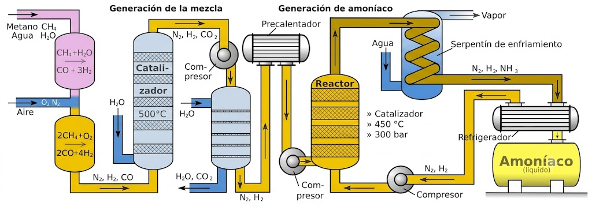
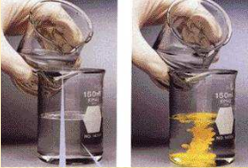
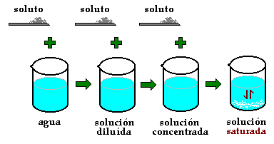
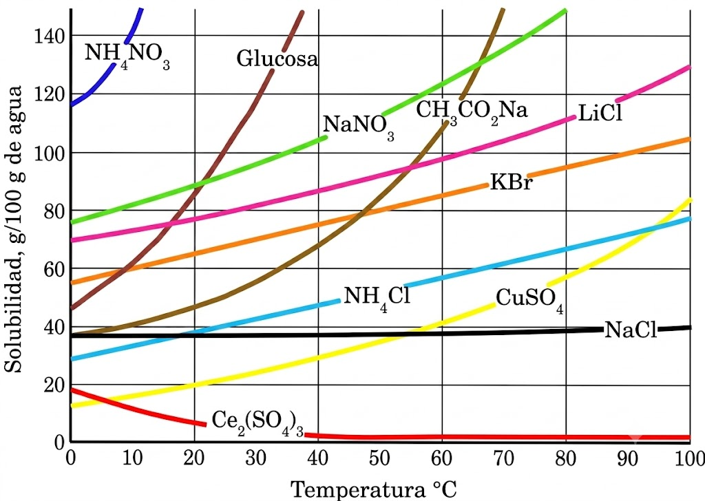

# Tema 5: Equilibrio químico

## **1. Concepto de equilibrio químico**

Con frecuencia, los productos que se forman en una reacción química comienzan a reaccionar entre sí para volver a dar los reactivos originales. A estas reacciones se las llama **reversibles**, y se significan con una **doble flecha** entre productos y reactivos:

$$\ce{\text{a} A \hspace{0.2cm} + \hspace{0.2cm} \text{b} B \hspace{0.2cm} \leftrightarrows \hspace{0.2cm} \text{c} C \hspace{0.2cm} + \hspace{0.2cm} \text{d} D}$$

Se suele denominar **proceso directo** al que va de izquierda a derecha, y **proceso inverso** al que va de derecha a izquierda.

Se dice que se ha **alcanzado el equilibrio químico** cuando la **velocidad** a la que ocurre el **proceso directo es igual** a la que se produce el **inverso**. De manera que la cantidad global de A, B, C y D permanece constante en el tiempo, aunque **la reacción química no se para en ningún momento**. Por eso se habla de “**equilibrio dinámico**”.

Ejemplo: $\ce{\quad N2O4 (g) \leftrightarrows 2 NO2 (g)}$

El tetraóxido de dinitrógeno gaseoso se descompone en dióxido de nitrógeno que a su vez vuelve a dar el óxido original.

En la tabla que se facilita a continuación se observa la variación con el tiempo de las concentraciones de los compuestos implicados:

{style="display: block; margin: 0 auto; width: 90%; border: 1px solid #333;"}

En la tabla se puede observar:

• Que la **concentración** de $\ce{N2O4}$ **disminuye con el tiempo **(cada vez más lentamente)

• Que la **concentración** de $\ce{NO2}$ **aumenta con el tiempo** (cada vez más lentamente)

• Que a partir de determinado instante las **concentraciones de ambos compuestos permanecen inalteradas** (aunque no son iguales).

**Gráficas c-t y v-t**

Los datos de la tabla anterior los podemos representar en gráficas como las siguientes, donde podemos apreciar las evoluciones de las concentraciones de reactivos y productos (izquierda), que acaban siendo constantes, aunque diferentes para cada sustancia, y las de las velocidades directa e inversa (derecha), que terminan siendo iguales.

{style="display: block; margin: 0 auto; height:300px; width: 90%; border: 1px solid #333;"}

## **2. Constante de equilibrio Kc**

En la reacción $\ce{a A + b B \leftrightarrows c C + d D}$, suponiendo que tanto el proceso directo como el inverso son procesos **elementales**, las expresiones de las velocidades directa e inversa serían:

$$\ce{v_d = k_d \cdot [A]^a \cdot [B]^b \quad y \quad v_i = k_i \cdot [C]^c \cdot [D]^d }$$

cuando se alcanza el equilibrio $\ce{v_d = v_i}$, por lo tanto:

$\ce{k_d \cdot [A]^a \cdot [B]^b = k_i \cdot [C]^c \cdot [D]^d}$, que podemos expresar así:

$$\ce{Kc = \dfrac {\ce{[C]^c \cdot [D]^d}}{\ce{[A]^a \cdot [B]^b}} }$$

Donde $\ce{Kc = \dfrac {\ce{K_d}}{\ce{K_i}}}$ es la **constante del equilibrio** referida a las **concentraciones**.

La constante **$\ce{Kc}$**, igual que ocurría con las constantes de velocidad **depende de la temperatura**, y por ello cuando dan el valor de $\ce{Kc}$ indican siempre la temperatura.

**Significado químico del valor de la constante de equilibrio**

La constante de equilibrio de una reacción química, $\ce{Kc}$ o $\ce{Kp}$, indica en que **grado los reactivos se transforman en productos**, una vez alcanzado el equilibrio.

Si **$\ce{K}$ es muy grande**: La reacción directa progresa hasta que **prácticamente se agota alguno de los reactivos**.

Si **$\ce{K \approx 1}$**: En el equilibrio, las concentraciones de reactivos y productos son **similares**.

Si **$\ce{K}$ es muy pequeña**: La reacción está muy desplazada hacia los reactivos. **Apenas se forman productos**.

{style="display: block; margin: 0 auto; height:275px; width: 90%; border: 1px solid #333;"}

**SOBRE $\ce{Kc}$**

- Su **expresión** (y por tanto su valor numérico) **depende de la forma en la que esté ajustada la ecuación** correspondiente.

**Ejemplos**:

\begin{array}{lll}
\ce{\dfrac {1}{2} N2 (g) + \dfrac {3}{2} H2 (g) \leftrightarrows NH3 (g)} & \hspace{1cm} & \ce{Kc = \dfrac {\ce{[NH3]}}{\ce{[N2]^{1/2} \cdot [H2]^{3/2}}} } \\
 & & \\
\ce{ N2 (g) + 3 H2 (g) \leftrightarrows 2 NH3 (g)} & \hspace{1cm} & \ce{Kc = \dfrac {\ce{[NH3]^2}}{\ce{[N2] \cdot [H2]^3}} } \\
 & & \\
\ce{2 NH3 (g) \leftrightarrows N2 (g) + 3 H2 (g) } & \hspace{1cm} & \ce{Kc = \dfrac {\ce{[N2] \cdot [H2]^3}}{\ce{[NH3]^2}} } \\
\end{array}

- Si en la reacción **intervienen sólidos o líquidos puros**, dado que su **concentración es constante**, se considera **incluida** en el valor de la constante de equilibrio.

**Ejemplo**: $\ce{\quad CaCO3 (s) \leftrightarrows CaO (s) + CO2 (g)}$

$$\ce{Kc^' = \dfrac {\ce{[CaO] \cdot [CO2]}}{\ce{[CaCO3]}} }$$

$$\ce{Kc = Kc^' \cdot \dfrac {\ce{[CaCO3]}}{\ce{[CaO]}} = [CO2]}$$

$$\ce{Kc = [CO2]}$$

- Si se **invierte una reacción química**, la constante de equilibrio de la reacción es la **inversa** de la reacción directa.

**Ejemplo**:

$$
\left.
\begin{aligned}
\ce{N2 (g) + 3 H2 (g) \leftrightarrows 2 NH3 (g) } \quad & \quad \ce{Kc_1 = \dfrac{[\ce{NH3}]^2}{[\ce{N2}] \cdot [\ce{H2}]^3}} \\
\\
\ce{2 NH3 (g) \leftrightarrows N2 (g) + 3 H2 (g) } \quad & \quad \ce{Kc_2 = \frac{[\ce{N2}] \cdot [\ce{H2}]^3}{[\ce{NH3}]^2}}
\end{aligned}
\right\}
\quad \ce{Kc_2 = \dfrac{1}{\ce{Kc_1}}}
$$

- Si **multiplicamos** una ecuación química por un número, **n**, la constante de equilibrio de la nueva reacción es igual a la de la antigua **elevada a la n-esima potencia**.

**Ejemplo**:

$$
\left.
\begin{aligned}
\ce{N2 (g) + 3 H2 (g) \leftrightarrows 2 NH3 (g) } \quad & \quad \ce{Kc_1 = \dfrac{\ce{[NH3]^2}}{\ce{[N2] \cdot [H2]^3}} } \\
\\
\ce{\frac {1}{2} N2 (g) + \frac {3}{2} H2 (g) \leftrightarrows NH3 (g) } \quad & \quad \ce{Kc_2 = \dfrac{\ce{[NH3]}}{\ce{[N2]^{1/2} \cdot [H2]^{3/2}}} }
\end{aligned}
\right\}
\quad \ce{Kc_2 = (Kc_1)^{1/2} }
$$

- Si **se suman dos ecuaciones** para dar una tercera, la constante de equilibrio de esta es el **producto** de las dos primeras.

**Ejemplo**:

$$
\begin{aligned}
\ce{C (s) + O2 (g) \leftrightarrows CO2 (g) } \quad & \quad \ce{Kc_1 = \dfrac{\ce{[CO2]}}{\ce{[O2]}} } \\
\\
\ce{ H2 (g) + CO2 (g) \leftrightarrows H2O (g) + CO (g) } \quad & \quad \ce{Kc_2 = \dfrac{\ce{[H2O] \cdot [CO]}}{\ce{[H2] \cdot [CO2]}} } \\
\\
\ce{ C (s) +  H2 (g) +  O2 (g) \leftrightarrows H2O (g) + CO (g) } \quad & \quad \ce{Kc = Kc_1 \cdot Kc_2 = \dfrac{\ce{[H2O] \cdot [CO]}}{\ce{[H2] \cdot [O2]}} } 
\end{aligned}
$$

- $\ce{Kc}$ puede tener unidades o no, dependerá de la ecuación considerada $^{(1)}$

**Ejemplos**:

$$
\begin{aligned}
\ce{H2 (g) + I2 (g) \leftrightarrows 2 HI (g) } \quad & \quad \ce{Kc = \dfrac{\ce{[I2]^2}}{\ce{[H2] \cdot [I2]}} } & \ce{No tiene unidades} \\
\\
\ce{ N2 (g) + 3 H2 (g) \leftrightarrows 2 NH3 (g) } \quad & \quad \ce{Kc = \dfrac{\ce{[NH3]^2}}{\ce{[N2] \cdot [H2]^2}} } & \ce{Unidades de Kc = \left(\frac {mol}{L}\right)^{-2} }\\
\end{aligned}
$$

1) Existe controversia sobre si $\ce{Kc}$ y $\ce{Kp}$ tienen dimensiones o son adimensionales. Para una justificación de esta postura ver el artículo de J. Quílez-Pardo y A. Quílez-Díaz publicado en Anales de Química (2013) http://bit.ly/18kte1L

**$\ce{\textbf{Kc}}$ y Q (Cociente de reacción)**

Se define el **cociente de reacción**, **Q**, como una expresión análoga a $\ce{Kc}$ pero en la que las concentraciones (en mol/L) no son las de equilibrio (representadas aquí con el subíndice "0"), tenemos:

$$\ce{Q = \dfrac {\ce{[C]^c_0 \cdot [D]^d_0}}{\ce{[A]^a_0 \cdot [B]^b_0}} }$$

En este caso, se pueden producir tres casos dependiendo donde se encuentre la reacción química. Si:

- Q = $\ce{Kc}$ el sistema está en equilibrio.

- Q < $\ce{Kc}$ el sistema no está en equilibrio. Evolucionará hacia el equilibrio aumentando las concentraciones de los productos (situadas en el numerador) y disminuyendo las de los reactivos (situadas en el denominador). Esto es: se **consumen los reactivos** para dar los productos **hasta alcanzar el equilibrio**.

- Q > $\ce{Kc}$ el sistema no está en equilibrio. Evolucionará hacia el equilibrio disminuyendo las concentraciones de los productos (situadas en el numerador) y aumentando las de los reactivos (situadas en el denominador). Esto es: se **consumen los productos** para dar los reactivos **hasta alcanzar el equilibrio**.

**Ejemplo 1**

La reacción: $\ce{H2 (g) + I2 (g) \leftrightarrows  2 HI(g)}$ tiene una $\ce{Kc = 50,2}$, a 445 $^{\circ}$C. En un recipiente de 3,5 L, en el que previamente se ha realizado el vacío, se introducen 0,30 g de $\ce{H2}$ (g), 38,07 g de $\ce{I2}$ (g) y 19,18 g de HI (g) a 445 $^{\circ}$C.

Calcule las concentraciones de $\ce{H2}$ (g), $\ce{I2}$ (g) y HI (g) en el equilibrio.

DATOS: Masas atómicas: H = 1 u; I = 126,9 u

**Solución**: Obtenemos los moles de las sustancias que intervienen en la reacción:

$\ce{0,30 g H2 \cdot \dfrac {\ce{1 mol H2}}{\ce{2,0 g H2}} = 0,15 mol H2 \quad \quad 38,07  g  I2\cdot\dfrac {\ce{1  mol  I2}}{\ce{253,8  g  I2}} = 0,15  moles  I2 }$ 

$\ce{19,18  g  HI \cdot \dfrac {\ce{1  mol  HI}}{\ce{127,9  g  HI}} = 0,15  moles  HI }$

Calculamos el cociente de reacción: 

$$
\left.
\begin{aligned}
& [\ce{HI}] = \frac{0,15 \text{ mol}}{3,5 \text{ L}} \\
\\
& [\ce{H2}] = [\ce{I2}] = \frac{0,15 \text{ mol}}{3,5 \text{ L}}
\end{aligned}
\right\} 
\quad \ce{Q} = \frac{[\ce{HI}]^2}{[\ce{H2}] \cdot [\ce{I2}]} = \frac{\left( \dfrac{0,15 \text{ mol}}{3,5 \text{ L}} \right)^2}{\left( \dfrac{0,15 \text{ mol}}{3,5 \text{ L}} \right)^2} = 1
$$

Como $\ce{Q < Kc}$ el **sistema no está en equilibrio**. Evolucionará hacia el equilibrio desplazándose hacia la derecha (formación de HI) ya que así aumentará el numerador y disminuirá el denominador hasta que $\ce{Q = Kc}$.

Supongamos ahora que reaccionan x moles de $\ce{H2}$, podríamos poner:

$$
\begin{array}{|c|c|c|c|}
\hline
\ce{Moles} & \ce{H2} & \ce{I2} & \ce{HI} \\ 
\hline
\ce{Iniciales} & \ce{0,15} & \ce{0,15} & \ce{0,15} \\ 
\hline
\ce{Reaccionan/se forman} & \ce{x} & \ce{x} & \ce{2 \cdot x} \\ 
\hline
\ce{Equilibrio} & \ce{0,15 - x} & \ce{0,15 - x} & \ce{0,15 + 2 \cdot x} \\
\hline
\end{array}
$$

Para el equilibrio:

$\ce{[HI] = \dfrac {\ce{0,15 + 2x  mol}}{\ce{3,5  L}} \quad \quad [H2] = [I2] = \dfrac {\ce{0,15 - x  mol}}{\ce{3,5  L}}}$

$\ce{K_C = \dfrac {\ce{[HI]^2}}{\ce{[H2]*[I2]}}  = \dfrac {\ce{\left(\dfrac {n_{HI}}{V}\right)^2}}{\ce{\left(\dfrac {n_{H_2}}{V}\right) \cdot \left(\dfrac {n_{I_2}}{V}\right)}} = \dfrac {\ce{ \left( \dfrac {\ce{0,15 + 2x  mol}}{\ce{3,5  L}} \right)^2 }}{\ce{\left( \dfrac {\ce{0,15 - x mol}}{\ce{3,5  L}} \right)^2}}  \quad \quad  50,2 = \dfrac {\ce{(0,15 + 2x)^2}}{\ce{(0,15 - x)^2}}  }$ 

Aplicamos raiz cuadrada en ambos términos:

$\ce{\sqrt{50,2} = \dfrac {\ce{0,15 + 2x}}{\ce{0,15 - x}} \quad \quad \longrightarrow  \quad \quad x = 0,10  mol }$ 

Por tanto las concentraciones en el equilibrio serán:

$\ce{[HI] = \dfrac {\ce{0,15 + 2 \cdot x  mol}}{\ce{3,5  L }} = \dfrac {\ce{0,15 + 2 \cdot0,100  mol}}{\ce{3,5  L }} = \boxed{\ce{0,100  \dfrac {mol}{L}}} }$

$\ce{[H2] = [I2] = \dfrac {\ce{0,15 - x  mol}}{\ce{3,5  L }} = \dfrac {\ce{0,15 - 0,100  mol}}{\ce{3,5  L }} = \boxed{\ce{ 0,014  \dfrac {mol}{L}}} }$

**EJEMPLO 2**

En un recipiente de 2 L, en el que inicialmente se ha realizado el vacío, se introducen 0,30 moles de $\ce{H2}$ (g), 0,20 moles de $\ce{NH3}$ (g) y 0,10 moles de $\ce{N2}$ (g). La mezcla se calienta hasta 400 $^{\circ}$C estableciéndose el equilibrio: $\ce{N2 (g) + 3 H2 (g) \leftrightarrows  2 NH3 (g)}$. La presión total de la mezcla gaseosa en el equilibrio es de 20 atmósferas.

a) Indique el sentido en que evoluciona el sistema inicial para alcanzar el estado de equilibrio. Justifique su respuesta.

b) Calcule el valor de la constante $\ce{Kc}$ para el equilibrio a 400 $^{\circ}$C.

DATOS: $\ce{R = 0,082 atm \cdot L \cdot mol^{-1} \cdot K^{-1}}$

**Solución**:

a) El número total de moles gaseosos es: 0,30 + 0,20 + 0,10 = 0,60 moles.

Si suponemos comportamiento ideal la presión total de la mezcla será:

$\ce{ P = \dfrac {\ce{n_{Tot} \cdot R \cdot T}}{\ce{V}} = \dfrac {\ce{0,60  mol \cdot 0,082 atm \cdot L \cdot mol^{-1} \cdot K^{-1} \cdot 673 K}}{\ce{2 L}} = 16,56 atm}$

En el enunciado se indica que la presión total de la mezcla es de 20 atm. El **sistema no está**, por tanto, en **equilibrio**. Evolucionará hacia él, aumentando la presión, lo que se consigue aumentando el número de moles gaseosos, luego la reacción tenderá a consumir amoniaco y dar nitrógeno e hidrógeno.

b) 

$$\ce{ 2 NH3 (g) \leftrightarrows N2 (g) + 3 H2 (g)}$$

Suponiendo que reaccionen $\ce{2 \cdot x}$ moles de $\ce{NH3}$

$$
\begin{array}{|c|c|c|c|}
\hline
\ce{Moles} & \ce{NH3} & \ce{N2} & \ce{H2} \\ 
\hline
\ce{Iniciales} & \ce{0,20} & \ce{0,10} & \ce{0,30} \\ 
\hline
\ce{Reaccionan/se forman} & \ce{2 \cdot x} & \ce{x} & \ce{3 \cdot x} \\ 
\hline
\ce{Equilibrio} & \ce{0,20 - 2 \cdot x} & \ce{0,10 - x} & \ce{0,30 + 3 \cdot x} \\
\hline
\end{array}
$$

Luego en el equilibrio tendremos un total de: $\ce{(0,20 - 2 \cdot x) + (0,10 + x) + (0,30 + 3 \cdot x) = 2 \cdot x + 0,60 mol}$.

Sabiendo la presión total podemos calcular el número total de moles gaseosos en el equilibrio:

$\ce{P \cdot V = n_T \cdot R \cdot T  \quad \longrightarrow \quad  n_T = \dfrac {\ce{P \cdot V}}{\ce{R \cdot T}} = \dfrac {\ce{20  atm \cdot 2  L}}{\ce{0,082  atm \cdot L \cdot mol^{-1} \cdot K^{-1} \cdot 673  K}} = 0,723  mol}$

Por tanto: $\ce{\quad 2 \cdot x + 0,60 = 0,723 \quad \quad x = 0,062 mol}$. Para el equilibrio:

$\ce{[NH3] = \dfrac {\ce{0,20 - 2 \cdot (0,062)  mol}}{\ce{2,0  L}} \quad {;} \quad [N2] = \dfrac {\ce{0,10 + 0,062  mol}}{\ce{2,0  L}} \quad {;} \quad [H2] = \dfrac {\ce{0,30 + 3 \cdot (0,062)  mol}}{\ce{2,0  L}} }$

 $\ce{K_{C} = \dfrac {\ce{[NH3]^2}}{\ce{[N2] \cdot [H2]^3}} = \dfrac {\ce{(0,038)^2 \cdot (mol \cdot L^{-1})^2 }}{\ce{(0,081) (mol \cdot L^{-1}) \cdot (0,24)^3 (mol \cdot L^{-1})^3}} = 1,29 }$

**Ley de las presiones parciales**

La **ley de las presiones parciales** (conocida también como **ley de Dalton**) establece que la presión de una mezcla de gases, **que no reaccionan químicamente**, es igual a la suma de las presiones parciales que ejercería cada uno de ellos si sólo uno ocupase todo el volumen de la mezcla, sin variar la temperatura. La ley de Dalton es muy útil cuando deseamos determinar la relación que existe entre las presiones parciales y la presión total de una mezcla de gases:

$$\ce{P_T = P_A + P_B + P_C}$$

Se llama **fracción molar de un gas** en una mezcla de gases, $\ce{\chi_i}$ al cociente entre el número de moles del gas i y el número de moles totales.

$$\ce{\chi_i = \dfrac {\ce{n_i}}{\ce{n_T}} }$$

La **presión parcial de un gas** se puede expresar como el producto de su fracción molar por la presión total:

$$\ce{p_i = \chi_i \cdot P_T}$$

**Constante de equilibrio en función de las presiones parciales ($\ce{\textbf{Kp}}$)**

En las reacciones en las que intervengan únicamente gases es más cómodo medir presiones que concentraciones, por eso se define la **constante de equilibrio** $\ce{Kp}$ en función de las **presiones parciales**:

$$\ce{\textrm{a} A (g) + \textrm{b} B (g) \leftrightarrows \textrm{c} C (g) + \textrm{d} D (g)}$$

$$\ce{Kp = \dfrac {\ce{p_C^c \cdot p_D^d}}{\ce{ p_A^a \cdot p_B^b}} }$$

donde, $\ce{p_A}$ = presión parcial del componente A; $\ce{p_B}$ = presión parcial del componente B; $\ce{p_C}$ = presión parcial del componente C; $\ce{p_D}$ = presión parcial del componente D

**Relación entre $\ce{Kp}$ y $\ce{Kc}$**

Para la reacción general: $\ce{\quad \quad \textrm{a} A (g) + \textrm{b} B (g) \leftrightarrows \textrm{c} C (g) + \textrm{d} D (g)}$

Usando la ecuación de los gases podemos relacionar la presión parcial y la concentración (en mol/L) de cada componente:

$$\ce{p_A \cdot V = n_A \cdot R \cdot T \hspace{1.5cm} p_A = \dfrac {\ce{n_A}}{\ce{V}} \cdot R \cdot T = c_A \cdot R \cdot T }$$

$$\ce{p_A = c_A \cdot R \cdot T = [A] \cdot R \cdot T \hspace{1.5cm} [A] = concentraci\acute{\ce{o}}n  de  A  en  \dfrac {\ce{mol}}{\ce{L}} }$$

Por tanto:

$$\ce{K_P = \dfrac {\ce{[P_C]^c \cdot [P_D]^d}}{\ce{[P_A]^a \cdot [P_B]^b}} = \dfrac {\ce{[C]^c \cdot [D]^d}}{\ce{[A]^a \cdot [B]^b}} \cdot \dfrac {\ce{(RT)^c \cdot (RT)^d}}{\ce{(RT)^a \cdot (RT)^b}} = \dfrac {\ce{[C]^c \cdot [D]^d}}{\ce{[A]^a \cdot [B]^b}} \cdot (RT)^{(c+d)-(a+b)} }$$

$$\ce{Kp = Kc \cdot (R \cdot T)^{\Delta n}}$$

$\Delta$n = incremento del número de moles gaseosos

**Ejemplo 3**

En un recipiente de 2,0 L, en el que previamente se ha realizado el vacío, se introducen 1,5 moles de $\ce{PCl5}$ (g), 0,5 moles de $\ce{PCl3}$ (g) y 1,0 mol de $\ce{Cl2}$ (g). La mezcla se calienta a 200 $^{\circ}$C, alcanzándose el equilibrio: 

$$\ce{PCl3 (g) + Cl2 (g) \leftrightarrows  PCl5 (g)}$$

Si en el equilibrio el número total de moles de gas es 2,57 calcule los valores de $\ce{Kp}$ y $\ce{Kc}$ a 200 $^{\circ}$C.

DATO: $\ce{R = 0,082 atm \cdot L \cdot K^{-1} \cdot mol^{-1}}$

**Solución**: 

Comprobamos si el sistema se encuentra en el equilibrio en las condiciones (iniciales) dadas en el enunciado. Para ello calculamos el número de moles gaseosos y comparamos con los que existen en el equilibrio.

$\ce{(n_{tot})_0 = (1,5 + 0,5 + 1,0) moles = 3,0 moles (gaseosos)}$

Como en el equilibrio existen 2,57 moles de gas, deducimos que el sistema no está en equilibrio. Evolucionará hacia el equilibrio disminuyendo el número de moles gaseosos, lo que se conseguirá si reaccionan $\ce{PCl3}$ y $\ce{Cl2}$ para dar $\ce{PCl5}$ (disminuye el número de moles gaseosos)

$$
\begin{array}{|l|c|c|c|}
\hline
\ce{Moles} & \ce{PCl3} & \ce{Cl2} & \ce{PCl5} \\ 
\hline
\ce{Iniciales} & \ce{0,5} & \ce{1,0} & \ce{1,5} \\ 
\hline
\ce{Reaccionan/se forman} & \ce{- x} & \ce{- x} & \ce{+ x} \\ 
\hline
\ce{Equilibrio} & \ce{0,5 - x} & \ce{1,0 - x} & \ce{1,5 + x} \\
\hline
\end{array}
$$

En el equilibrio se debe de cumplir:

$$\ce{n_{tot} = (0,5 - x) + (1,0 - x) + (1,5 + x) = 2,57}$$

Por tanto: $\ce{\quad x = 0,43 moles}$

Y para el equilibrio:

$\ce{[PCl3] = \dfrac {\ce{n_{PCl_3}}}{\ce{V}} = \dfrac {\ce{0,5 - x}}{\ce{2,0 L}} = \dfrac {\ce{0,5 - 0,43  mol}}{\ce{2,0  L}} = 0,035  moles \cdot L^{-1}}$ 

$\ce{[Cl2] = \dfrac {\ce{n_{Cl_2}}}{\ce{V}}  = \dfrac {\ce{1,0 - x}}{\ce{2,0 L}} = \dfrac {\ce{1,0 - 0,43  mol}}{\ce{2,0  L}} = 0,285  moles \cdot L^{-1}}$

$\ce{[PCl5] = \dfrac {\ce{n_{PCl_5}}}{\ce{V}}  = \dfrac {\ce{1,5 + x}}{\ce{2,0 L}} = \dfrac {\ce{1,5 + 0,43  mol}}{\ce{2,0  L}} = 0,965  moles \cdot L^{-1}}$

$\ce{Kc = \dfrac {\ce{[PCl5]}}{\ce{[PCl3] \cdot [Cl2]}} = \dfrac {\ce{0,965  moles \cdot L^{-1}}}{\ce{(0,035  moles \cdot L^{-1}) \cdot (0,285  moles \cdot L^{-1})}} = \boxed{\ce{96,7 }} }$

Y ahora calculamos $\ce{Kp}$, sabiendo que $\ce{\Delta n = 1 - 2 = -1}$

$\ce{Kp = Kc \cdot (RT)^{\Delta n} = 96,7  moles^{-1} \cdot L \cdot ( 0,082  atm \cdot L \cdot K^{-1} \cdot mol^{-1} \cdot 473 K)^{-1} = \boxed{\ce{2,49 }} }$

**Ejemplo 4**

En un matraz de 1,75 L, en el que previamente se ha realizado el vacío, se introducen 0,1 moles de CO (g) y 1 mol de $\ce{COCl2}$ (g). A continuación se establece el equilibrio a 668 K: $\ce{\quad CO (g) + Cl2 (g) \leftrightarrows  COCl2 (g) \quad}$ Si en el equilibrio la presión parcial de $\ce{Cl2}$ (g) es 10 atm, calcule:

a) Las presiones parciales de CO (g) y de $\ce{COCl2}$ (g) en el equilibrio.

b) Los valores de $\ce{Kc}$ y $\ce{Kp}$ para la reacción a 668 K.

DATO: $\ce{R = 0,082 atm \cdot L \cdot K^{-1} \cdot mol^{-1}}$

**Solución**: 

Como en el enunciado se dice que no existe cloro inicialmente, el equilibrio, forzosamente, ha de establecerse gracias a la descomposición del $\ce{COCl2}$ (g), luego:

$$\ce{COCl2 (g)  \leftrightarrows CO (g) + Cl2 (g) }$$

$$
\begin{array}{|l|c|c|c|}
\hline
\ce{Moles} & \ce{COCl2} & \ce{CO} & \ce{Cl2} \\ 
\hline
\ce{Iniciales} & \ce{1,0} & \ce{0,1} & \ce{0} \\ 
\hline
\ce{Reaccionan/se forman} & \ce{- x} & \ce{+ x} & \ce{+ x} \\ 
\hline
\ce{Equilibrio} & \ce{1,0 - x} & \ce{0,1 + x} & \ce{x} \\
\hline
\end{array}
$$

Los moles de cloro (gas) en el equilibrio se pueden calcular a partir de su presión
parcial:

$\ce{
P_{\ce{Cl2}} \cdot V = n_{\ce{Cl2}} \cdot R \cdot T \quad \rightarrow \quad n_{\ce{Cl2}} = \dfrac {\ce{P_{\ce{Cl2}} \cdot V}}{\ce{R \cdot T}} = \dfrac {\ce{10 atm \cdot 1,75 L}}{\ce{0,082 atm \cdot L \cdot K^{-1} \cdot mol^{-1} \cdot 668 K}} 
= 0,319 moles
}$

Por tanto, x = 0,319 moles.

Para el equilibrio:

$\ce{n (CO) = 0,1 + x = 0,1 + 0,319 = 0,419 mol}$

$\ce{n (Cl2) = x = 0,319 mol}$

$\ce{n (COCl2) = 1,0 - x = 1,0 - 0,319 = 0,681 mol}$

$\ce{n_{tot} = (0,419 + 0,319 + 0,681) mol = 1,419 mol}$

Podemos calcular las presiones parciales en el equilibrio a partir de los moles en el equilibrio y la expresión: $\ce{P_i \cdot V = n_i \cdot R \cdot T \quad \rightarrow \quad P_i = \dfrac {\ce{n_i \cdot R \cdot T}}{\ce{V}} }$

Para el CO:

$\ce{P_{CO} = \dfrac {\ce{n_{CO} \cdot R \cdot T}}{\ce{V}} = \dfrac {\ce{0,419 mol \cdot 0,082 atm \cdot L \cdot K^{-1} \cdot mol^{-1} \cdot 668 K}}{\ce{1,75 L}} = 13,11 atm}$

Repitiendo el cálculo para el $\ce{COCl2}$, obtenemos: $\ce{\quad P_{COCl_2} = 21,32 atm}$

Las constantes de equilibrio valdrán:

$\ce{Kp = \dfrac {\ce{P_{\ce{COCl2}}}}{\ce{P_{CO} \cdot P_{\ce{Cl2}}}} = \dfrac {\ce{21,32}}{\ce{13,11 \cdot 10}} = \boxed{\ce{0,163}} }$ 

Y para calcular $\ce{Kc}$:     $\ce{K_C = \dfrac {\ce{K_P}}{\ce{(RT)^{\Delta n}}} }$ 

$\ce{Kc = \dfrac {\ce{0,163}}{\ce{(0,082 \cdot 668)^{-1}}} = \boxed{\ce{8,87}} }$ 

**Relación entre $\ce{\textbf{Kc}}$ y el grado de disociación**

Una de las aplicaciones importantes de $\ce{Kc}$ es el cálculo del rendimiento de una reacción quimica, es decir, el grado de desplazamiento hacia los productos. Obviamente, cuanto mayor sea $\ce{Kc}$, mayor será ese desplazamiento hacia los productos.

Se define **grado de disociación**, en tanto por uno, de un proceso químico, al cociente entre el número de moles disociados dividido entre el número total de moles iniciales:

$$\ce{\alpha \; = \dfrac {\ce{x}}{\ce{n_0}} }$$

Multiplicando el cociente por 100 obtendríamos el grado de disociación en porcentaje.

Hay que avisar que en este contexto, “disociación” puede no coincidir exactamente con una separación en dos partes de una sustancia, sino que en general, se refiere al grado de reacción.

## **3. Factores que influyen en el equilibrio. Principio de Le Chatelier**

Una vez establecido el equilibrio en un sistema, éste **se puede ver alterado** debido a la influencia de condiciones externas, entonces el **sistema evolucionará para volver a restablecer el equilibrio**.

Según el **principio de Le Chatelier** (1884):

"**Si un sistema en equilibrio es perturbado (se modifican alguno de los factores que influyen en el mismo: temperatura, presión o concentración), evolucionará en el sentido de anular (contrarrestar) la perturbación introducida hasta alcanzar de nuevo el equilibrio**"

**3.1. Efecto de la temperatura**

**Es la única variable que, además de influir en el equilibrio, modifica el valor de su constante**.

Si una vez alcanzado **el equilibrio se aumenta la temperatura**, el sistema se opone a ese aumento de temperatura desplazándose en el sentido que absorba calor, es decir, en el sentido **endotérmico**.

Por ejemplo, en la reacción

$$\ce{N2 (g) + 3 H2 (g) \leftrightarrows  2 NH3 (g) \quad \quad \Delta H = - 92 kJ}$$

Si **aumentamos la temperatura** el sistema se desplazará hacia la izquierda (sentido **endotérmico**), y si la **disminuimos** hacia la derecha (sentido **exotérmico**).

**3.2. Efecto de la presión y el volumen**

La **variación de presión en el equilibrio influye solo** si en el mismo intervienen **especies en estado gaseoso** o **disueltas** y hay **variación en el número de moles**, ya que **si $\ce{\Delta n = 0}$**, **no tiene ninguna influencia** las variaciones en la presión.

Si **aumenta la presión**, el sistema se desplazará hacia donde haya **menor número de moles gaseosos** -según la estequiometría de la reacción- para así contrarrestar el efecto de la disminución del volumen y viceversa.

En el ejemplo de la síntesis del amoníaco visto antes, si aumentamos la presión total, disminuirá el volumen, y el equilibrio se desplazará hacia donde menos moles de gas haya, es decir, hacia la formación de amoníaco.

**3.3. Efecto de las concentraciones**

Las **variaciones de concentración** **no afectan** a la constante de equilibrio, $\ce{Kc}$.

Por eso mismo, cuando modificamos una concentración, por ejemplo, retirando el amoníaco que se va formando a partir de nitrógeno e hidrógeno, para mantener constante el valor de $\ce{Kc}$ el equilibrio se desplaza hacia la derecha, disminuyendo así también las concentraciones de $\ce{N2}$ y $\ce{H2}$.

$$\ce{N2 (g) + 3 H2 (g) \leftrightarrows  2 NH3 (g) \hspace{2cm} Kc = \dfrac {\ce{[NH3]^2}}{\ce{[N2] \cdot [H2]^3}} }$$

Lo que sucede es que, según el principio de Le Chatelier, el sistema se desplazará en el sentido que contrarreste o neutralice esa modificación para volver a alcanzar un nuevo estado de equilibrio.

- Si inyectas más gas $\ce{N2}$ (reactivo), el sistema se desplaza a la derecha ($\rightarrow$) para gastarlo, produciendo más $\ce{NH3}$.
  
- Si vas retirando el $\ce{NH3}$ (producto) a medida que se forma, el sistema se desplaza a la derecha ($\rightarrow$) para reponerlo.

- Si quitas gas $\ce{H2}$ (reactivo), el sistema se desplaza a la izquierda ($\leftarrow$) para volver a generar el hidrógeno que se perdió.

Un error muy común es pensar que al cambiar las concentraciones cambia el valor de la constante de equilibrio. La **constante** $\ce{Kc}$ (o $\ce{Kp}$) **NO varía**. Cuando cambian las concentraciones, lo que cambia temporalmente es el cociente de reacción, $\ce{Q}$. El sistema se desplaza en una dirección u otra precisamente para que las nuevas concentraciones en el equilibrio vuelvan a dar exactamente el mismo valor matemático de $\ce{Kc}$. La única variable capaz de cambiar el valor real de una constante de equilibrio es la temperatura.

**Síntesis del amoníaco**

Se trata de un buen ejemplo que combina los diferentes aspectos de la ley de Le Chatelier.

Es una reacción muy lenta, puesto que tiene una elevada energía de activación consecuencia de la estabilidad del $\ce{N2}$.

La solución al problema fue utilizar un catalizador (óxido de hierro) y aumentar la presión (entre 150-300 atm), ya que esto favorece la formación del producto. Aunque termodinámicamente la reacción transcurre mejor a bajas temperaturas, esta síntesis se realiza a altas temperaturas (400-500 $^{\circ}$C) para favorecer la energía cinética de las moléculas y aumentar así la velocidad de reacción. Además se va retirando el amoníaco a medida que se va produciendo para favorecer todavía más la síntesis de productos.

{style="display: block; margin: 0 auto; height:400px ; width: 90%; border: 1px solid #333;"}

## **4. Reacciones de precipitación: equilibrios heterogéneos sólido-líquido**

Las **reacciones de precipitación** son aquellas que tienen lugar entre **iones en disolución para formar sustancias insolubles**. A la sustancia que aparece se le llama **precipitado**, de ahí el nombre de estas reacciones. Nosotros nos limitaremos a estudiar casos de compuestos iónicos disueltos en agua.

{style="display: block; margin: 0 auto; height:200px ; width: 50%; border: 1px solid #333;"}

**Cuando ha aparecido un precipitado** y por lo tanto tenemos un sólido en el fondo del recipiente, **se establece un equilibrio entre el sólido y sus iones**. Por ejemplo, si tenemos yoduro de plomo precipitado en el fondo de un recipiente en el que tenemos agua e iones $\ce{Pb^{2+}}$ e $\ce{I^-}$, se establece el equilibrio:

$$\ce{PbI2 (s) \leftrightarrows  Pb^{2+} (ac) + 2 I^- (ac)}$$

Como ocurre en todos los equilibrios, aparentemente no ocurre nada, pues las cantidades sólidas y en disolución no varían, pero se trara de un proceso dinámico, en el que constantemente está disolviéndose sólido y precipitando éste. Para comprender mejor estos procesos debemos repasar el concepto de solubilidad.

**4.1. Solubilidad**

Cuando echamos una pequeña cantidad de sólido al agua, si éste se disuelve decimos que tenemos una **disolución diluída**. Si seguimos añadiendo más sólido y se sigue disolviendo, la disolución se vuelve **concentrada**. Llega un momento en que ya no se puede disolver más sólido aunque sigamos añadiendo. Decimos que la disolución se ha **saturado**.

{style="display: block; margin: 0 auto; height:200px ; width: 50%; border: 1px solid #333;"}

Una **disolución saturada**, por lo tanto, es aquella que ya **no admite más soluto**. Pues bien, a la **concentración de una disolución saturada** de un determinado compuesto se le llama **solubilidad** de dicho compuesto. La solubilidad depende de la temperatura, por ello en las tablas de solubilidad se especifica la temperatura a la que está medida (habitualmente 20 $^{\circ}$C).

Podemos hablar de sustancias solubles e insolubles, pero es relativo, aunque sea poco, todas se disuelven algo. Por decir un número podemos considerar poco solubles a las sustancias con solubilidades menores de 0,01 mol/L.

**Solubilidad y temperatura**

El aumento de temperatura proporciona una energía al cristal que favorece las vibraciones de los iones y resulta más sencillo al disolvente vencer las fuerzas que los mantiene unidos.

En la **mayoría de los compuestos** el **aumento de la temperatura **conlleva un **aumento en la solubilidad**, pero de muy diferente manera en unos y otros.

Aunque no es de este tema, recordad sin embargo que la **solubilidad de los gases disminuye con la temperatura**.

{style="display: block; margin: 0 auto; height:400px ; width: 70%; border: 1px solid #333;"}

**Espontaneidad de las disoluciones**

Recordemos que un proceso es espontáneo si la energía libre de Gibbs, $\ce{\Delta G}$, de valor $\ce{\Delta G = \Delta H - T \cdot \Delta S}$ es negativa.

En cuanto al factor energético, $\ce{\Delta G}$, para ver si es positivo o negativo habremos de comparar la **energía reticular del cristal** con la **energía de solvatación** (cantidad de energía que se libera o se absorbe cuando las partículas de un soluto se disuelven en un disolvente y quedan completamente rodeadas por las moléculas de este). Por ejemplo, para el cloruro de litio:

$$\begin{array}{ll}
\ce{LiCl  (s) \rightarrow  Li^+  (g) + Cl^-  (g)} & \ce{\quad \quad U = 827,6  kJ/mol} \\ 
\underline{\ce{Li^+  (g) + Cl^-  (g) \rightarrow  Li^+  (ac) + Cl^-  (ac)}} &  \quad \quad \underline{\ce{E_{solvatación} = - 882  kJ/mol}}  \\
\ce{LiCl  (s) \rightarrow  Li^+  (ac) + Cl^-  (ac)} & \ce{\quad \quad E_{disolución} = - 54,4  kJ/mol} \\
\end{array}$$

El hecho de ser globalmente un proceso exotérmico favorece la espontaneidad de la disolución de la sal. A medida que se acrecienta el carácter covalente de un compuesto se dificulta la solvatación y por ello la solubilidad. Recordemos además cómo influían el radio iónico y la carga de los iones en el valor de la energía reticular y por lo tanto en la solubilidad de las sustancias iónicas.

Pero hay sustancias, como el $\ce{NH4Cl}$, que aunque su disolución es endotérmica, sin embargo es espontánea. Eso ocurre porque el factor entrópico es siempre favorable a la disolución, ya que el desorden aumenta mucho y por lo tanto $\ce{T \cdot \Delta S > 0}$.

El conjunto de ambos factores determinará la solubilidad mayor o menor de una sustancia iónica.

**4.2. Producto de solubilidad**

Como decíamos, en el caso de sales poco solubles, una pequeña parte se encuentra disociada en sus iones, mientras que la mayor parte permanece en estado sólido, estableciéndose un **equilibrio dinámico entre la parte disuelta y la fase sólida o precipitado**.

Para un equilibrio general del tipo:

$$\ce{AxBy (s) \quad \leftrightarrows \quad \textrm{x} A^+ (ac) \quad + \quad \textrm{y} B^- (ac)}$$

Podemos escribir la expresión de la constante de equilibrio correspondiente que se reducirá al producto de las concentraciones de los iones en disolución.

La constante para este tipo de equilibrios recibe el nombre de **constante del producto de solubilidad** o, simplemente, **producto de solubilidad**:

$$\ce{Kps = [A^+]^x \cdot [B^-]^y }$$

Ejemplos:

$$\begin{array}{ll}
\ce{AgCl  (s) \leftrightarrows  Ag^+  (ac) + Cl^-  (ac)} & \ce{\quad K_{PS} = [Ag^+] * [Cl^-] }  \\
\\
\ce{PbI2  (s) \leftrightarrows  Pb^{2+}  (ac) + 2  I^-  (ac)} & \ce{\quad K_{PS} = [Pb^{2+}] * [I^-]^2}  \\ 
\\
\ce{BaSO4  (s) \leftrightarrows  Ba^{2+}  (ac) + SO4^{2-}  (ac)} & \ce{\quad K_{PS} = [Ba^{2+}] * [SO4^{2-}]}  \\
\\
\ce{CoCO3  (s) \leftrightarrows  Co^{2+}  (ac) + CO3^{2-}  (ac)} & \ce{\quad K_{PS} = [Co^{2+}] * [CO3^{2-}]} \\
\\
\ce{Fe(OH)3  (s) \leftrightarrows  Fe^{3+}  (ac) + 3  OH^{-}  (ac)} & \ce{\quad K_{PS} = [Fe^{3+}] * [OH^{-}]^3}  \\
\\
\ce{PbS  (s) \leftrightarrows  Pb^{2+}  (ac) + S^{2-} (ac)} & \ce{\quad K_{PS} = [Pb^{2+}] * [S^{2-}]}
\end{array}$$

**4.3. Relación entre $\ce{Kps}$ y solubilidad**

La constante del producto de solubilidad se puede relacionar fácilmente con la (muy pequeña) solubilidad de los compuestos.

Si suponemos que la solubilidad del AgCl es **s** (moles/L), podemos escribir:

$$
\ce{AgCl (s) \rightleftarrows} \ \underset{\rule{0pt}{1.3em}\text{S}}{\ce{Ag+ (ac)}} + \underset{\rule{0pt}{1.3em}\text{S}}{\ce{Cl- (ac)}}
$$

$$\ce{Kps = [Ag+] \cdot [Cl-] = s \cdot s = s^2}$$

Análogamente:

$$\ce{PbI2 (s) \leftrightarrows  \underset{\rule{0pt}{1.3em}\text{S}}{Pb^{2+} (ac)} + \underset{\rule{0pt}{1.3em}2 \cdot \text{S}}{2 I- (ac)} \hspace{2cm} Kps = [Pb^{2+}] \cdot [I^-]^2 = s \cdot (2 \cdot s)^2 = 4 \cdot s^3}$$

$$\ce{Fe(OH)3 (s) \leftrightarrows  \underset{\rule{0pt}{1.3em}\text{S}}{Fe^{3+} (ac)} + \underset{\rule{0pt}{1.3em}3 \cdot \text{S}}{3 OH^- (ac)} \hspace{2cm}  Kps = [Fe^{3+}] \cdot [OH-]^3 = s \cdot (3 \cdot s)^3 = 27 \cdot s^4}$$

Son muy frecuentes los ejercicios en los que a partir de s hay que calcular $\ce{Kps}$ o viceversa.

Veamos un par de ejemplos.

**Ejemplo 1**

La solubilidad del cloruro de plata en agua es de $\ce{1,92 \cdot 10^{-4}}$ g de compuesto por 100 mL de disolución. Calcule la constante de solubilidad del cloruro de plata.

DATOS: Masas atómicas: Ag = 107,8 u; Cl = 35,5 u

**Solución**:

El equilibrio de solubilidad para el cloruro de plata lo escribiremos en la forma:

$$\ce{AgCl (s) \leftrightarrows  \underset{\rule{0pt}{1.3em}\text{S}}{Ag+ (ac)} + \underset{\rule{0pt}{1.3em}\text{S}}{Cl- (ac)}}$$

A partir de la expresión de la constante del producto de solubilidad podemos establecer la relación con la solubilidad (en moles/L)

$$\ce{Kps = [Ag^+] \cdot [Cl^-] = s \cdot s = s^2}$$

Expresemos la solubilidad dada en moles/L:

$$\ce{\dfrac {\ce{1,92 \cdot 10^{-4} \text{g} AgCl}}{\ce{100 mL disol}}  \cdot  \dfrac {\ce{1000 mL disol}}{\ce{1 L disol}} \cdot \dfrac {\ce{1 mol AgCl}}{\ce{143,3 g AgCl}} = 1,34 \cdot 10^{-5} mol \cdot L^{-1}}$$

Por tanto la constante del producto de solubilidad para el cloruro de plata valdrá:

$$\ce{Kps = [Ag+] \cdot [Cl-] = s \cdot s = s^2 = (1,34 \cdot 10^{-5})^2 = 1,80 \cdot 10^{-10} }$$

**Ejemplo 2**

Se añaden 10 mg de carbonato de estroncio sólido, $\ce{SrCO3}$ (s), a 2 L de agua pura. Calcule la cantidad de SrCO3 (s) que queda sin disolver. Suponga que no hay variación de volumen al añadir el sólido al agua.

DATOS: Masas atómicas: $\ce{Sr = 87,6 u; C = 12 u; O = 16 u}$. $\ce{Kps (SrCO3) = 5,6 \cdot 10^{-10}}$

**Solución**:

A partir de la expresión de la constante del producto de solubilidad podemos calcular la solubilidad del carbonato de estroncio:

$$\ce{SrCO3 (s) \leftrightarrows \underset{\rule{0pt}{1.3em}\text{S}}{Sr^{2+} (ac)} + \underset{\rule{0pt}{1.3em}\text{S}}{CO3^{2-} (ac)}}$$

$$\ce{Kps = [Sr^{2+}] * [CO3^{2-}] = s * s = s^2}$$

$$\ce{s = \sqrt {Kps} = \sqrt {\ce{5,6*10^{-10} }} = 2,4*10^{-5} mol*L^{-1}}$$

Luego los gramos de carbonato de estroncio disueltos en 2 L de agua serán:

$$\ce{2 L \cdot \dfrac {\ce{2,4\cdot10^{-5} mol}}{\ce{1 L}} \cdot \dfrac {\ce{147,6 g SrCO3}}{\ce{1 mol}} = 7,1 \cdot 10^{-3} \text{g} SrCO3 = 7,1 mg SrCO3}$$ 

Luego quedan sin disolver:

$$\ce{(10 - 7,1) mg SrCO3 = 2,9 mg SrCO3}$$

**4.4. Relacion entre $\ce{Kps}$ y Q**

La constante de solubilidad está relacionada con las concentraciones máximas de los iones en disolución, de tal manera que si definimos (de forma análoga a como se hizo en el tratamiento de la constante de equilibrio) un producto de concentraciones (**producto iónico**) análogo al producto de solubilidad, pero con concentraciones que no sean las correspondientes al equilibrio:

$$\ce{Q = [A]_0^x \cdot [B]_0^y }$$

...comparando $\ce{Q}$ con $\ce{Kps}$ podemos determinar si existirá precipitación o no:

- Si $\ce{Q < Kps}$ $\quad$ **No habrá precipitado**. La disolución no está saturada y puede disolver más compuesto.
  
- Si $\ce{Q = Kps}$ $\quad$ La **disolución está saturada**. Existirá precipitado y una pequeña parte de la sustancia se encuentra disuelta y en equilibrio con la fase sólida.

- Si $\ce{Q > Kps}$ $\quad$ Estamos **por encima del punto de saturación de la disolución**. Solo se disolverá sustancia hasta que la disolución se sature. El resto se depositará en el fondo.

**Ejemplo 3**

Indique, de forma razonada, si se formará precipitado en una disolución que contenga las
siguientes concentraciones: $\ce{[Ca^{2+}] = 0,0037; [CO3^{2-}] = 0,0068}$.

DATO: $\ce{Kps = 2,8 \cdot 10^{-9}}$

**Solución**:

El equilibrio de solubilidad para el carbonato de calcio es:

$$\ce{CaCO3 (s) \leftrightarrows \underset{\rule{0pt}{1.3em}\text{S}}{Ca^{2+} (ac)} + \underset{\rule{0pt}{1.3em}\text{S}}{CO3^{2-} (ac)}}$$

La expresión de la constante del producto de solubilidad será:

$$\ce{Kps = [Ca^{2+}] \cdot [CO3^{2-}] = 2,8 \cdot 10^{-9}}$$

El producto iónico correspondiente a las concentraciones dadas en el enunciado será:

$$\ce{Q = [Ca^{2+}]_0 \cdot [CO3^{2-}]_0 = 3,7 \cdot 10^{-3} \cdot 6,8 \cdot 10^{-3} = 2,5 \cdot 10^{-5} (mol \cdot L^{-1})^2}$$

**Como $\ce{\textbf{Q > Kps}}$ se formará precipitado.**

**Ejemplo 4**

Si mezclamos 10,0 mL de una disolución acuosa de $\ce{BaCl2}$ 0,10 M con 40,0 mL de una disolución acuosa de $\ce{Na2SO4}$ 0,025 M.

a) Determine si se formará precipitado de $\ce{BaSO4}$.

b) Calcule las concentraciones de $\ce{Ba^{2+}}$ (ac) y $\ce{SO4^{2-}}$ (ac) en la disolución después de producirse la precipitación.

Dato: $\ce{Kps (BaSO4) = 1,1 \cdot 10^{-10}}$

**Solución**:

El equilibrio de solubilidad para el sulfato de bario lo escribiremos en la forma:

$$\ce{BaSO4 (s) \leftrightarrows \underset{\rule{0pt}{1.3em}\text{S}}{Ba^{2+} (ac)} + \underset{\rule{0pt}{1.3em}\text{S}}{SO4^{2-} (ac)} }$$

La expresión de la constante del producto de solubilidad será:

$$\ce{Kps = [Ba^{2+}] \cdot [SO4^{2-}]}$$

Los moles de $\ce{Ba^{2+}}$ y $\ce{SO4^{2-}}$ presentes en cada una de las disoluciones que se van a mezclar son:

I) Disolución de $\ce{BaCl2}$ (sal soluble en agua):

$$\ce{
\xcancel{\ce{BaCl2}} (s) \rightarrow Ba^{2+} (ac) + 2 Cl^{-} (ac) \quad \Rightarrow \quad [Ba^{2+}] = [BaCl2] {;} \quad [Cl^-] = 2 \cdot [BaCl2]
}$$

$$\ce{10 mL disol * \dfrac {\ce{0,10 mol Ba^{2+}}}{\ce{1000 mL disol}} = 10^{-3} mol Ba^{2+}}$$

II) Disolución de $\ce{Na2SO4}$ (sal soluble):

$$\ce{
\xcancel{\ce{Na2SO4}} (s) \rightarrow 2 Na^+ (ac) + SO4^{2-} (ac) \quad \Rightarrow \quad [Na^+] = 2 \cdot [Na2SO4] ; \quad [SO4^{2-}] = [Na2SO4]
}$$

$$\ce{40 mL disol \cdot \dfrac {\ce{0,025 mol SO4^{2-}}}{\ce{1000 mL disol}} = 10^{-3} mol SO4^{2-}}$$

Al mezclar las disoluciones tendremos un volumen total de 50 mL (suponiendo volúmenes aditivos). Las concentraciones de $\ce{Ba^{2+}}$ y $\ce{SO4^{2-}}$ serán por tanto (ambos son iguales):

$$\ce{\dfrac {\ce{10^{-3} moles}}{\ce{50 mL}} \cdot \dfrac {\ce{1000 mL}}{\ce{1 L}} = 2,0 \cdot 10^{-2} mol \cdot L^{-1} }$$

El producto iónico (Q) correspondiente a estas concentraciones será:

$$\ce{Q = [Ba^{2+}]_0 \cdot [SO4^{2-}]_0 = 2,0 \cdot 10^{-2} \cdot 2,0 \cdot 10^{-2} = 4,0 \cdot 10^{-4} \; (mol \cdot L^{-1})^2}$$

Comparando este valor con el de $\ce{Kps}$ ($\ce{Kps (BaSO4) = 1,1 \cdot 10^{-10}}$) vemos que es muy superior.

**Como $\ce{\textbf{Q > Kps}}$ aparecerá precipitado.**

Las concentraciones de $\ce{Ba^{2+}}$ y $\ce{SO4^{2-}}$ presentes en disolución vendrán dadas por la $\ce{Kps}$ según:

$$\ce{Kps = [Ba^{2+}] \cdot [SO4^{2-}] = s \cdot s = s^2}$$

$$\ce{s = \sqrt {Kps} = \sqrt {\ce{1,1 \cdot 10^{-10} }} = 1,1 \cdot 10^{-5}  mol \cdot L^{-1}} $$

**4.5. Disolución de precipitados**

Una vez formados los precipitados pueden disolverse (desaparición de la fase sólida) desplazando el equilibrio de solubilidad hacia la derecha. De manera general lo conseguiremos haciendo que alguno de los iones en disolución sea retirado de la misma. La forma de hacerlo depende del equilibrio considerado.

Veamos algunos ejemplos.

**I) Disolución de hidróxidos.**

Los hidróxidos insolubles se disuelven añadiendo ácido, ya que el $\ce{OH-}$ se combina con los iones H3 O+ (catión oxonio) formados a partir de los protones procedentes de la ionización del ácido:

$$\begin{align*} 
\ce{Mg(OH) (s) \leftrightarrows Mg^{2+} (ac) + 2 \; &OH^- (ac)} \\ 
&+ \\
\ce{2 \; &H3O+ \rightarrow 4 H2O}  
\end{align*}$$

**II) Disolución de sales procedentes de ácidos débiles (carbonatos, la mayor parte de los sulfuros, cromatos...)**

Estas sales se disuelven también al añadir ácido a la disolución ya que se forma el ácido débil del cual provienen. Este método es especialmente efectivo en el caso de los carbonatos, ya que el ácido carbónico formado es muy inestable y se descompone de forma inmediata dando $\ce{CO2}$ que escapa de la disolución (formación de burbujas)

$$\begin{align*}
\ce{CoCO3 (s) \leftrightarrows Co^{2+} (ac) + CO3^{2-} (ac)}  \\ 
\ce{CO3^{2-} (ac) + 2 H3O+ (ac) \leftrightarrows H2CO3 (ac) + 2 H2O (l)}  \\ 
\ce{H2CO3 (ac) \leftrightarrows CO2 (g) + 2 H2O (l)}  \\ 
\rule{76mm}{0.2mm}  \\
\ce{CoCO3 (s) + 2 H3O+ (ac) \rightarrow CO2 (g) + 3 H2O (l) + Co^{2+} } 
\end{align*}$$

Ecuación (molecular) global: $\ce{\quad CoCO3 (s) + 2 HCl (ac) \rightarrow CO2 (g) + CoCl2 (ac) + H2O (l)}$

La mayor parte de los sulfuros también se disuelven en ácidos formando $\ce{H2S (g)}$:

$$\ce{CoS (s) + 2 HCl (ac) \rightarrow H2S (g) + CoCl2 (ac)}$$

**III) Disolución de sales de plata por formación de un complejo**

Es típica la disolución del cloruro de plata al añadir amoniaco, ya que al formarse el complejo $\ce{[Ag(NH3)2]^+}$, el catión $\ce{Ag^+}$ es retirado de la disolución:

$$\ce{AgCl (s) \leftrightarrows  Ag+ (ac) + Cl- (ac)}$$

$$\ce{Ag+ (ac) + NH3 (ac) \leftrightarrows [Ag(NH3)2]^+ (ac)}$$

## **5. Efecto del ión común**

De la definición de producto de solubilidad se deduce que, al aumentar la concentración de uno de los iones que forman el precipitado, la concentración del otro debe disminuir con el objetivo de que $\ce{Kps}$ permanezca constante.

Es el efecto conocido como “**ión común**”, que es de gran utilidad para el análisis químico, y concretamente para reducir la solubilidad de muchos precipitados, o para precipitar totalmente un ión usando un exceso de agente precipitante. Veámoslo con un ejemplo.

**Ejemplo 5**

A 25 C$^{\circ}$ la solubilidad del $\ce{PbI2}$ en agua pura es 0,7 g/L. Calcule:

a) El producto de solubilidad.

b) La solubilidad del $\ce{PbI2}$ a esa temperatura en una disolución 0,1 M de KI.

Masas atómicas: I = 127; Pb = 207

**Solución**:

El apartado a) ya sabemos hacerlo. Lo novedoso es el b.

El equilibrio es: $\ce{\quad PbI2 (s) \leftrightarrows  Pb^{2+} (ac) + 2 I- (ac)}$

Si tuviéramos solo $\ce{PbI2}$ la concentración de yoduro sería justo el doble que la de plomo (II), pero como tenemos KI, que es totalmente soluble, en este caso [$\ce{I-}$] = 0,1 M (se desprecia por irrelevante la pequeña cantidad de iones yoduro provenientes de la sal insoluble). Así que podemos calcular la [$\ce{Pb^{2+}}$] en estas nuevas condiciones (el dato de $\ce{Kps}$ está calculado en el apartado a) $\ce{Kps = 1,37 \cdot 10^{-8}}$:

$\ce{ Kps = [Pb^{2+}] \cdot [I^-]^2 \quad \rightarrow \quad [Pb^{2+}] = \dfrac {\ce{Kps}}{\ce{[I^-]^2}} = \dfrac {\ce{1,37 \cdot 10^{-8}}}{\ce{0,1^2}} = 1,37 \cdot 10^{-6} \; mol \cdot L^{-1} }$

$\ce{\dfrac {\ce{1,37 \cdot 10^{-6} mol}}{\ce{1 L}} \cdot \dfrac {\ce{461 g PbI2}}{\ce{1 mol PbI2}} = 6,34 \cdot 10^{-4} g \cdot L^{-1}}$ 

Si comparamos este resultado con la solubilidad que nos da el enunciado (0,7 g/l), podemos observar cómo influye en este caso el efecto del “ión común” ($\ce{I-}$)